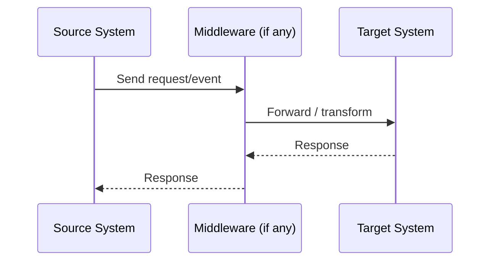
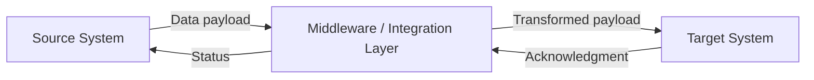

# Integration Spec: {Source System} → {Target System}

| Field              | Value                        |
|--------------------|------------------------------|
| **Spec Version**   | 1.0                          |
| **Status**         | Draft / In Review / Approved |
| **Client/Project** |                              |
| **Engagement ID**  |                              |
| **Author**         |                              |
| **Last Updated**   |                              |
| **Reviewers**      |                              |
| **Pattern Reference** | (if reusable pattern)     |

---

## 1. Overview

### 1.1 Business Purpose

> Why does this integration exist? What business process or capability does it enable?

### 1.2 Systems Involved

| Role    | System           | Version | Owner / Team | Client/Vendor |
|---------|------------------|---------|--------------|---------------|
| Source  |                  |         |              |               |
| Target  |                  |         |              |               |
| Middleware |               |         |              |               |

### 1.3 Integration Pattern

> Point-to-point, pub/sub, request-response, ETL, event-driven, etc.

### 1.4 Data Flow Direction

> One-way (source → target), bidirectional, or request-response.

---

## 2. Business Requirements

### 2.1 Functional Requirements

- 

### 2.2 Business Rules

- 

### 2.3 Stakeholders

| Name | Role | Organization | Responsibility |
|------|------|--------------|----------------|
|      |      | Client       |                |
|      |      | DXP Team     |                |

---

## 3. Technical Requirements

### 3.1 Endpoints

| System | Environment | Base URL / Connection String | Region | Notes |
|--------|-------------|------------------------------|--------|-------|
|        | DEV         |                              |        |       |
|        | QA          |                              |        |       |
|        | UAT         |                              |        |       |
|        | STAGING     |                              |        |       |
|        | PROD        |                              |        |       |
|        | PROD (DR)   |                              |        |       |

### 3.2 Protocol & Transport

> REST, SOAP, GraphQL, gRPC, AMQP, SFTP, JDBC, etc.

### 3.3 Authentication & Authorization

| Property          | Value |
|-------------------|-------|
| **Auth Method**   |       |
| **Token Endpoint**|       |
| **Scopes / Roles**|       |
| **Cert Required** |       |

### 3.4 Rate Limits & Throttling

> Known API rate limits, concurrency limits, or throttling policies.

---

## 4. Integration Approach

### 4.1 Architecture Overview

> High-level description from the SA. Middleware, transformation layers, orchestration, etc.

### 4.2 Sequence Diagram



### 4.3 Data Flow Diagram



### 4.4 Assumptions

- 

### 4.5 Constraints

- 

### 4.6 Known Risks

| Risk | Impact | Mitigation |
|------|--------|------------|
|      |        |            |

---

## 5. Data Mapping

### 5.1 Entities Exchanged

> List the data objects or entities being transferred (e.g., Order, Customer, Invoice).

### 5.2 Field-Level Mapping

| # | Source Field | Source Type | Target Field | Target Type | Transformation | Required | Notes |
|---|-------------|-------------|--------------|-------------|----------------|----------|-------|
| 1 |             |             |              |             |                |          |       |

### 5.3 Transformation Rules

> Describe any non-trivial transformations: data type conversions, concatenations, lookups, conditional mappings, default values, etc.

---

## 6. Sample Payloads

### 6.1 Request / Outbound Payload

```json
{
}
```

### 6.2 Response / Inbound Payload

```json
{
}
```

### 6.3 Error Payload

```json
{
}
```

---

## 7. Error Handling

### 7.1 Error Scenarios

| Scenario | HTTP Status / Error Code | Handling Strategy |
|----------|--------------------------|-------------------|
| Timeout  |                          |                   |
| 4xx      |                          |                   |
| 5xx      |                          |                   |
| Payload validation failure | |                   |

### 7.2 Retry Strategy

| Property             | Value |
|----------------------|-------|
| **Max Retries**      |       |
| **Backoff Strategy** |       |
| **Dead Letter Queue**|       |

### 7.3 Alerting & Monitoring

> How are failures surfaced? Dashboards, alerts, logs, etc.

---

## 8. Non-Functional Requirements

### 8.1 SLAs

| Metric         | Target       |
|----------------|--------------|
| Availability   |              |
| Latency (p95)  |              |
| Throughput      |              |

### 8.2 Data Volume & Frequency

| Property          | Value |
|-------------------|-------|
| **Trigger**       | Event-driven / Scheduled / On-demand |
| **Frequency**     |       |
| **Avg Payload Size** |    |
| **Peak Volume**   |       |

### 8.3 Security & Compliance

> Data classification, PII handling, encryption in transit/at rest, regulatory requirements.

### 8.4 DXP-Specific Considerations

**Multi-Channel Delivery:**
> Web, mobile app, native apps, IoT, headless/API delivery

**Personalization & Analytics:**
| Consideration | Details |
|---------------|----------|
| Personalization data flow |  |
| Analytics/tracking events |  |
| Customer data synchronization | |

**Content Delivery:**
| Consideration | Details |
|---------------|----------|
| CDN strategy |  |
| Cache invalidation approach |  |
| Preview vs. Published modes |  |
| A/B testing integration |  |

**Performance:**
| Consideration | Details |
|---------------|----------|
| Image optimization pipeline |  |
| Lazy loading requirements |  |
| Edge caching rules |  |

---

## 9. Testing Strategy

### 9.1 Test Approach

> Unit, integration, contract, end-to-end.

### 9.2 Test Scenarios

| # | Scenario | Input | Expected Output | Type |
|---|----------|-------|-----------------|------|
| 1 |          |       |                 |      |

### 9.3 Test Environments

> Which environments will be used for integration testing and how connectivity is established.

---

## 10. Deployment & Operability

### 10.1 Deployment Steps

1. 

### 10.2 Rollback Plan

> 

### 10.3 Runbook

> Link to or describe operational procedures for monitoring and troubleshooting.

---

## 11. Client Handoff & Support

### 11.1 Client Documentation

> Links to client-facing documentation, API usage guides, integration guides

### 11.2 Support Responsibilities

| Responsibility | DXP Team | Client Team | Vendor |
|----------------|----------|-------------|--------|
| Integration monitoring |  |  |  |
| Error triage |  |  |  |
| API credential management |  |  |  |
| Endpoint updates |  |  |  |
| Data mapping changes |  |  |  |
| Performance optimization |  |  |  |

### 11.3 Escalation Path

| Severity | First Contact | Escalation Point | SLA |
|----------|---------------|------------------|-----|
| P1 (Critical) |  |  |  |
| P2 (High) |  |  |  |
| P3 (Medium) |  |  |  |
| P4 (Low) |  |  |  |

### 11.4 Client Access & Monitoring

> Dashboards, logs, monitoring tools the client has access to

---

## 12. Open Items

| # | Item | Owner | Due Date | Status |
|---|------|-------|----------|--------|
| 1 |      |       |          |        |

---

## 13. Approval

| Role | Name | Date | Signature |
|------|------|------|-----------|
| Solution Architect |  |  |  |
| Dev Lead |  |  |  |
| Client Technical Lead |  |  |  |
| Client Business Owner |  |  |  |
| DXP Delivery Manager |  |  |  |
