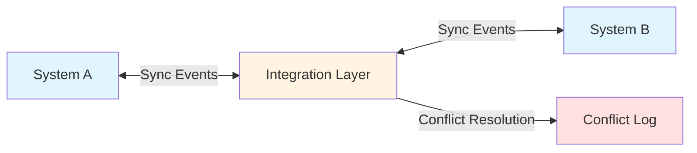

# Pattern: Bidirectional Data Synchronization

**Pattern Type:** Bidirectional Synchronization  
**Common Use Cases:** 
- Two-way data exchange between systems
- Keeping data consistent across multiple systems
- Distributed data management where multiple systems can update shared entities
- Master data synchronization with conflict resolution

---

## Overview

This pattern describes bidirectional synchronization between two systems where data can be created or updated in either system and changes must be synchronized to maintain consistency. This pattern requires conflict resolution strategies when the same record is updated in both systems.

## Architecture Pattern



## Integration Approach

### Data Flow: System A → System B
1. Record created or updated in System A
2. System A triggers sync event (webhook, change data capture, polling)
3. Integration layer retrieves record from System A
4. Integration layer transforms data to System B format
5. Integration layer checks for conflicts (last modified timestamp, version number)
6. If no conflict, record updated in System B
7. Sync status recorded

### Data Flow: System B → System A
1. Record created or updated in System B
2. System B triggers sync event
3. Integration layer retrieves record from System B
4. Integration layer transforms data to System A format
5. Integration layer checks for conflicts
6. If no conflict, record updated in System A
7. Sync status recorded

### Conflict Resolution Strategies

| Strategy | Description | Use Case |
|----------|-------------|----------|
| **Last Write Wins** | Most recent timestamp takes precedence | Simple scenarios with clear ownership |
| **System Priority** | One system always wins conflicts | When one system is authoritative |
| **Manual Review** | Flag conflicts for human resolution | Critical data requiring review |
| **Merge** | Combine non-conflicting fields | Complex records with independent fields |
| **Version Control** | Track versions and allow rollback | Audit trail requirements |

## Common Data Objects

### Sync Metadata (Required for Conflict Detection)

| Field | Purpose | Example |
|-------|---------|---------|
| `externalId` | Link records across systems | `sys-a-12345` |
| `lastModified` | Timestamp for conflict detection | `2026-04-22T10:30:00Z` |
| `lastModifiedBy` | User/system who made change | `user@example.com` |
| `version` | Version number for optimistic locking | `5` |
| `syncStatus` | Current sync state | `synced`, `pending`, `conflict` |
| `sourceSystem` | Which system originated the change | `system-a` |

### Typical Record Structure

```json
{
  "id": "record-12345",
  "externalIds": {
    "systemA": "a-12345",
    "systemB": "b-67890"
  },
  "data": {
    // Business data fields
  },
  "syncMetadata": {
    "lastModified": "2026-04-22T10:30:00Z",
    "lastModifiedBy": "user@example.com",
    "version": 5,
    "syncStatus": "synced",
    "sourceSystem": "system-a"
  }
}
```

## Synchronization Triggers

| Trigger Type | Description | Latency | Use Case |
|--------------|-------------|---------|----------|
| **Webhooks** | Real-time event notification | < 5 seconds | Real-time sync requirements |
| **Change Data Capture (CDC)** | Database transaction log monitoring | < 30 seconds | Database-driven systems |
| **Polling** | Scheduled checks for changes | 1-60 minutes | Systems without event support |
| **Message Queue** | Event-driven async messaging | < 10 seconds | High reliability requirements |

## Error Handling

### Sync Failures

| Scenario | Handling Strategy |
|----------|-------------------|
| Target system unavailable | Queue changes, retry with exponential backoff |
| Data validation failure | Log error, alert, require manual fix |
| Duplicate record | Use externalId mapping to update existing |
| Conflict detected | Apply conflict resolution strategy |
| Network timeout | Retry up to 3 times, then queue for manual review |

### Retry Strategy

```
Initial retry: 30 seconds
Retry 2: 2 minutes
Retry 3: 10 minutes
Retry 4: 30 minutes
Retry 5: 2 hours
After 5 failures: Move to dead-letter queue for manual intervention
```

## Implementation Checklist

- [ ] Define which entities will be synchronized
- [ ] Establish field-level mappings (bidirectional)
- [ ] Configure sync triggers (webhooks, CDC, polling)
- [ ] Implement conflict detection logic
- [ ] Choose conflict resolution strategy
- [ ] Create externalId mapping table
- [ ] Implement retry logic with exponential backoff
- [ ] Set up dead-letter queue for failed syncs
- [ ] Create conflict log and alert system
- [ ] Implement sync status dashboard
- [ ] Define sync frequency/latency requirements
- [ ] Test bidirectional create, update, delete scenarios
- [ ] Test conflict scenarios (simultaneous updates)
- [ ] Document data ownership rules

## Performance Considerations

### Latency
- Target sync latency: < 1 minute for webhooks, < 15 minutes for polling
- Conflict detection overhead: ~50-100ms per record

### Throughput
- Batch sync operations where possible (100-500 records per batch)
- Parallel processing for high-volume scenarios
- Rate limiting to avoid overwhelming target systems

### Scalability
- Use message queues to decouple sync operations
- Implement idempotency to handle duplicate events
- Cache externalId mappings to reduce lookups

## Monitoring & Observability

### Key Metrics
- Sync success rate (%)
- Average sync latency (seconds)
- Conflict rate (%)
- Failed sync count (by error type)
- Records in sync queue (depth)
- Data consistency score (spot checks)

### Alerts
- Sync failure rate > 5% over 15 minutes
- Conflict rate > 10%
- Sync queue depth > 1000 records
- System unavailable for > 5 minutes

## Known Variations

### Variation 1: Hub-and-Spoke
- Central integration hub manages multiple bidirectional syncs
- Hub maintains golden record/master data
- Spokes are peripheral systems

### Variation 2: Master-Slave with Sync Back
- One system is master (authoritative)
- Changes flow primarily from master to slave
- Limited fields can be updated in slave and synced back

### Variation 3: Event Sourcing
- All changes captured as immutable events
- Each system replays event log to rebuild state
- Perfect audit trail, more complex implementation

## Anti-Patterns to Avoid

❌ **Infinite Loops**: Ensure sync events don't trigger reverse syncs  
❌ **No Conflict Detection**: Always implement timestamp or version checking  
❌ **Synchronous Blocking**: Don't block user operations waiting for sync  
❌ **No Idempotency**: Duplicate events must not create duplicate records  
❌ **Missing Rollback**: Have strategy to undo failed partial syncs

## Example Use Cases

- **CRM ↔ Marketing Automation**: Contact/account data synchronized bidirectionally
- **ERP ↔ E-commerce**: Inventory levels, order status, product information
- **HR System ↔ Identity Provider**: User profiles, department information
- **Source Control ↔ Issue Tracker**: Code branches, tickets, pull requests
- **Asset Management ↔ Content Delivery**: Digital assets and metadata

## Related Patterns

- [Unidirectional Sync](unidirectional-sync.md) - Simpler one-way data flow
- [Master Data Sync](master-data-sync.md) - Single source of truth approach
- [Event Streaming](event-streaming.md) - Event-driven architecture alternative
