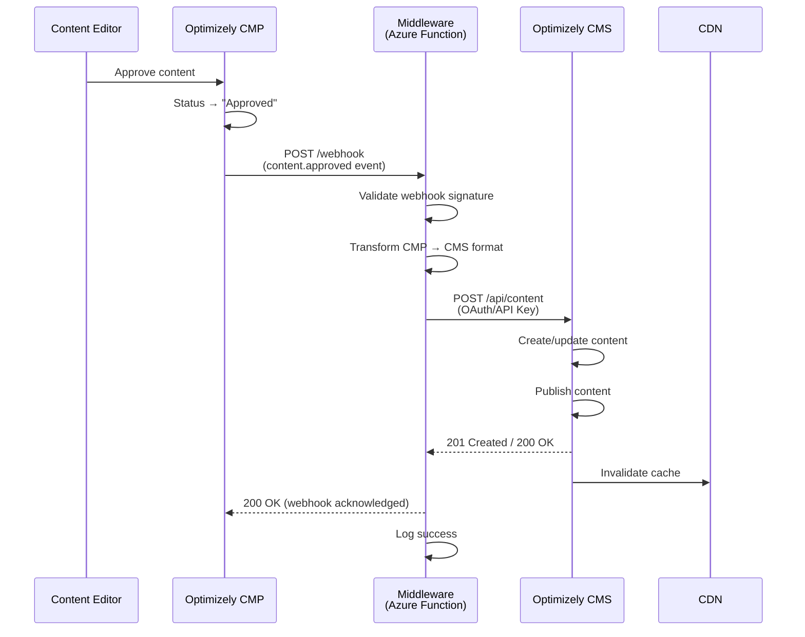
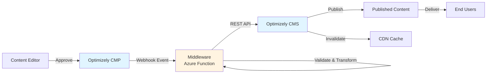

# Integration Spec: Optimizely CMP → Optimizely CMS

| Field              | Value                        |
|--------------------|------------------------------|
| **Spec Version**   | 2.0                          |
| **Status**         | Draft                        |
| **Client/Project** | [Your Client Name]           |
| **Engagement ID**  | [Project/Engagement ID]      |
| **Author**         | Integration Team             |
| **Last Updated**   | April 22, 2026               |
| **Reviewers**      | TBD                          |
| **Pattern Reference** | rest-api-integration, webhook-integration |

---

## 1. Overview

### 1.1 Business Purpose

This integration enables seamless content publishing from Optimizely Content Marketing Platform (CMP) to Optimizely Content Management System (CMS), solving critical workflow inefficiencies in the content lifecycle.

**Problems Solved:**
- Eliminates manual copy-paste between CMP and CMS
- Ensures faster go-to-market for campaigns
- Maintains content consistency across systems
- Allows marketers to work fully in CMP while CMS handles delivery
- Reduces human error in content transfer

### 1.2 Systems Involved

| Role    | System           | Version | Owner / Team | Client/Vendor |
|---------|------------------|---------|--------------|---------------|
| Source  | Optimizely Content Marketing Platform | SaaS | Marketing Team | Vendor (Optimizely) |
| Target  | Optimizely Content Management System | SaaS/DXP | Digital Experience Team | Vendor (Optimizely) |
| Middleware | Azure Functions / Logic Apps | Latest | IT / Platform Engineering | Client |

### 1.3 Integration Pattern

**Pattern:** Event-driven, webhook-based, point-to-point integration

**Approach:**
- CMP triggers webhook on content approval/publish events
- Middleware receives webhook, validates, and transforms payload
- Middleware calls CMS REST API to create/update content
- CMS publishes content and invalidates CDN cache

### 1.4 Data Flow Direction

**One-way (CMP → CMS)**
- Triggered by approval/publish events in CMP
- No reverse synchronization (CMS does not update CMP)

---

## 2. Business Requirements

### 2.1 Functional Requirements

- Content approved in CMP must automatically trigger publish to CMS
- Only content with "Approved" status should be publishable
- Metadata (author, tags, campaign info, SEO fields) must be preserved
- Content lifecycle: Draft → Review → Approved → Published (CMP) → Published (CMS)
- Support for articles, blogs, and landing pages
- Media assets must be referenced or synced from CMP to CMS

### 2.2 Business Rules

- **Only "Approved" content triggers CMS publish** - Draft or Review status does not trigger integration
- **Publish date/time honored** - If scheduled publish date is set in CMP, CMS StartPublish field must be set accordingly
- **Author attribution preserved** - Original content author from CMP must be mapped to CMS
- **Campaign tracking maintained** - Campaign IDs and metadata must be preserved for analytics
- **Content versioning** - CMS must handle updates to existing content gracefully

### 2.3 Stakeholders

| Name | Role | Organization | Responsibility |
|------|------|--------------|----------------|
| TBD | Content Creators / Campaign Managers | Client (Marketing Team) | Content authoring in CMP |
| TBD | Digital Experience Lead | Client (DX Team) | CMS configuration, content delivery |
| TBD | Product Owner | Client | Business requirements, priorities |
| TBD | Integration Engineer | Service Team (IT / Platform Engineering) | Integration development, monitoring |
| TBD | Solution Architect | Service Team | Architecture, design decisions |

---

## 3. Technical Requirements

### 3.1 Endpoints

| System | Environment | Base URL / Connection String | Region | Notes |
|--------|-------------|------------------------------|--------|-------|
| CMP (Webhook Sender) | DEV | TBD — Confirm CMP dev instance webhook URL |  | Webhook configuration |
| CMP | QA | TBD — Confirm CMP QA instance webhook URL |  | Webhook configuration |
| CMP | UAT | TBD — Confirm CMP UAT instance webhook URL |  | Webhook configuration |
| CMP | PROD | TBD — Confirm CMP production webhook URL |  | Webhook configuration |
| CMS API | DEV | TBD — Confirm CMS dev API endpoint |  | Content Management API |
| CMS API | QA | TBD — Confirm CMS QA API endpoint |  | Content Management API |
| CMS API | UAT | TBD — Confirm CMS UAT API endpoint |  | Content Management API |
| CMS API | PROD | TBD — Confirm CMS production API endpoint |  | Content Management API |
| Middleware | DEV | TBD — Azure Function/Logic App dev endpoint |  | Integration layer |
| Middleware | QA | TBD — Azure Function/Logic App QA endpoint |  | Integration layer |
| Middleware | UAT | TBD — Azure Function/Logic App UAT endpoint |  | Integration layer |
| Middleware | PROD | TBD — Azure Function/Logic App prod endpoint |  | Integration layer |

### 3.2 Protocol & Transport

**Primary Protocols:**
- **CMP → Middleware:** Webhooks (HTTP POST over HTTPS)
- **Middleware → CMS:** REST API (HTTPS)

**Message Format:** JSON

### 3.3 Authentication & Authorization

| Property          | Value |
|-------------------|-------|
| **Auth Method (CMP → Middleware)** | API Key / Webhook secret validation (HMAC signature) |
| **Auth Method (Middleware → CMS)** | OAuth 2.0 or API Key (TBD - depends on CMS setup) |
| **Token Endpoint** | TBD — Confirm CMS OAuth token endpoint |
| **Scopes / Roles** | Content Editor or Administrator role required |
| **Cert Required** | No (TLS 1.2+ for all connections) |

### 3.4 Rate Limits & Throttling

**CMS API Rate Limits:** TBD — Confirm with Optimizely CMS documentation

**Expected Rate:**
- Normal: 5-20 publish events per hour
- Peak (campaign launches): Up to 100 events per hour

**Mitigation:** 
- Implement request throttling in middleware
- Use queue-based processing if rate limits approached

---

## 4. Integration Approach

### 4.1 Architecture Overview

The integration follows an **event-driven, webhook-triggered architecture**:

1. **Event Trigger:** Content approval in CMP triggers webhook
2. **Webhook Delivery:** CMP sends HTTP POST to middleware endpoint with content payload
3. **Validation:** Middleware validates webhook signature and content status
4. **Transformation:** Middleware transforms CMP payload to CMS-compatible format
5. **API Call:** Middleware calls CMS Content Management API to create/update content
6. **Publishing:** CMS publishes content and returns success confirmation
7. **Cache Invalidation:** CMS triggers CDN cache invalidation
8. **Status Callback:** Middleware logs success/failure (optional callback to CMP)

**Middleware Technology:** Azure Functions or Azure Logic Apps (cloud-hosted, serverless)

### 4.2 Sequence Diagram



### 4.3 Data Flow Diagram



### 4.4 Assumptions

- CMP content model aligns with CMS content types (articles, blogs, landing pages)
- CMP and CMS share same organizational/tenant context (or are properly configured for cross-tenant access)
- Webhook delivery from CMP is reliable (Optimizely SaaS infrastructure)
- CMS can handle concurrent publish requests during peak campaign launches
- Media assets are accessible via URLs (hosted in CMP DAM or external CDN)

### 4.5 Constraints

- **Content Model Alignment:** CMP content structure must map cleanly to CMS content types
- **Rich Text Formatting:** HTML from CMP may require sanitization or transformation for CMS
- **Asset References:** Assets in CMP must be resolvable URLs accessible by CMS
- **API Rate Limits:** CMS API has rate limits that may impact bulk publish scenarios
- **Network Dependency:** Integration relies on stable network connectivity between cloud services

### 4.6 Known Risks

| Risk | Impact | Mitigation |
|------|--------|------------|
| Content published before full approval | High — Non-compliant content on live site | Validate "Approved" status in middleware before CMS API call |
| Content model mismatch between CMP and CMS | High — Publish failures, data loss | Formal field mapping document; validation testing |
| Webhook delivery failure | Medium — Content not published | Implement retry logic with exponential backoff; dead-letter queue |
| CMS API rate limiting during peak | Medium — Delayed publishes | Implement throttling and queue-based processing |
| Asset URLs not accessible by CMS | Medium — Content displays without images | Validate asset URLs; fallback to placeholder images |
| Duplicate webhook events | Low — Duplicate publish attempts | Implement idempotency checking with CMP content ID |
| Middleware downtime | High — Integration unavailable | Deploy middleware with high availability; monitoring and alerting |

---

## 5. Data Mapping

### 5.1 Entities Exchanged

**Primary Entities:**
- **Content Items:** Articles, blogs, landing pages
- **Metadata:** Author, tags, categories, campaign info, SEO fields
- **Media Assets:** Images, documents (referenced by URL)
- **Publish Schedule:** Publish date, expiry date

### 5.2 Field-Level Mapping

| # | Source Field (CMP) | Source Type | Target Field (CMS) | Target Type | Transformation | Required | Notes |
|---|-------------------|-------------|-------------------|-------------|----------------|----------|-------|
| 1 | `id` | string | `externalId` | string | Direct | Yes | CMP content ID for idempotency |
| 2 | `title` | string | `name` | string | Direct | Yes | Content headline |
| 3 | `body` | string (HTML) | `mainBody` | XhtmlString | HTML sanitization | Yes | May require cleanup |
| 4 | `status` | string | N/A | N/A | Validation only | Yes | Must be "approved" |
| 5 | `author` | string | `author` | string | Direct | Yes | Content creator name |
| 6 | `tags` | array[string] | `categories` | CategoryList | Map to CMS taxonomy | No | Tag resolution |
| 7 | `publishDate` | ISO 8601 | `startPublish` | DateTime | Timezone conversion to UTC | Yes | Schedule publish |
| 8 | `expiryDate` | ISO 8601 | `stopPublish` | DateTime | Timezone conversion to UTC | No | Optional expiry |
| 9 | `campaign` | string | `campaignReference` | string | Direct (custom property) | No | Campaign tracking |
| 10 | `seo.metaTitle` | string | `metaTitle` | string | Direct | No | SEO metadata |
| 11 | `seo.metaDescription` | string | `metaDescription` | string | Direct | No | SEO metadata |
| 12 | `seo.focusKeyword` | string | `focusKeyword` | string | Direct (custom property) | No | SEO optimization |
| 13 | `featuredImage` | string (URL) | `teaserImage` | ContentReference | Resolve URL to CMS media reference | No | Asset resolution |
| 14 | `contentType` | string | `contentType` | string | Map CMP type to CMS type ID | Yes | e.g., "article" → CMS ArticlePage type |

### 5.3 Transformation Rules

**HTML Content (body):**
- Strip unsupported HTML tags
- Convert CMP-specific markup to CMS-compatible format
- Validate all `` and `<a>` href attributes are absolute URLs

**Date/Time:**
- Convert all ISO 8601 timestamps from CMP timezone to UTC for CMS
- Handle null/empty publish dates by using current timestamp

**Tags/Categories:**
- Look up CMP tags in CMS taxonomy
- If tag doesn't exist in CMS, either create dynamically or log warning
- Default to "General" category if no match found

**Content Type Mapping:**
| CMP Content Type | CMS Content Type |
|------------------|------------------|
| `article` | `ArticlePage` |
| `blog_post` | `BlogPost` |
| `landing_page` | `LandingPage` |

**Asset References:**
- Extract image URLs from CMP payload
- Validate URLs are publicly accessible
- If CMS requires local asset storage, download and upload to CMS media library
- Fallback to placeholder image if asset unavailable

---

## 6. Sample Payloads

### 6.1 Request / Outbound Payload (CMP Webhook Event)

```json
{
  "id": "cmp-12345",
  "type": "content.approved",
  "timestamp": "2026-04-22T10:30:00Z",
  "data": {
    "id": "cmp-12345",
    "title": "New Campaign Launch",
    "body": "<p>Content from CMP</p>",
    "status": "approved",
    "author": "John Doe",
    "tags": ["campaign", "launch", "marketing"],
    "publishDate": "2026-05-01T10:00:00Z",
    "expiryDate": null,
    "campaign": "Q2-2026-Launch",
    "seo": {
      "metaTitle": "New Campaign Launch | Company Blog",
      "metaDescription": "Learn about our exciting new campaign launching in Q2 2026.",
      "focusKeyword": "campaign launch"
    },
    "featuredImage": "https://cmp-assets.example.com/featured.jpg",
    "contentType": "article"
  }
}
```

### 6.2 Response / Inbound Payload (CMS API Response)

```json
{
  "contentLink": {
    "id": 98765,
    "workId": 0,
    "guidValue": "a1b2c3d4-e5f6-7890-abcd-ef1234567890"
  },
  "name": "New Campaign Launch",
  "contentType": ["ArticlePage"],
  "status": "Published",
  "language": {
    "name": "en"
  },
  "externalId": "cmp-12345",
  "startPublish": "2026-05-01T10:00:00Z",
  "created": "2026-04-22T10:30:15Z",
  "saved": "2026-04-22T10:30:15Z"
}
```

### 6.3 Error Payload (CMS API Error)

```json
{
  "error": {
    "code": "VALIDATION_ERROR",
    "message": "Content type 'ArticlePage' not found or user lacks permissions",
    "details": [
      {
        "field": "contentType",
        "issue": "Invalid content type specified"
      }
    ],
    "requestId": "req-abc123",
    "timestamp": "2026-04-22T10:30:20Z"
  }
}
```

---

## 7. Error Handling

### 7.1 Error Scenarios

| Scenario | HTTP Status / Error Code | Handling Strategy |
|----------|--------------------------|-------------------|
| Webhook signature validation failure | 401 Unauthorized | Reject immediately, log security event, alert |
| CMP status not "approved" | 400 Bad Request | Reject with error message, do not retry |
| CMS API timeout | 504 Gateway Timeout | Retry with exponential backoff (max 5 attempts) |
| CMS API 4xx errors (validation, not found) | 400, 404, 422 | Log error, alert, do not retry (permanent failure) |
| CMS API 5xx errors (server error) | 500, 502, 503 | Retry with exponential backoff (max 5 attempts) |
| Payload transformation failure | Internal error | Log with full payload, alert, dead-letter queue |
| Content type mapping not found | Internal error | Log error, alert, manual intervention required |
| Asset URL not accessible | Warning | Proceed with publish but log warning |

### 7.2 Retry Strategy

| Property             | Value |
|----------------------|-------|
| **Max Retries**      | 5 attempts |
| **Backoff Strategy** | Exponential backoff: 30s, 2min, 5min, 15min, 1hour |
| **Dead Letter Queue**| Yes — Azure Storage Queue or Service Bus DLQ |
| **Idempotency**      | Check CMP content ID (externalId) before creating new content in CMS |
| **Timeout**          | 30 seconds per CMS API call |

**Retry Logic:**
- Attempt 1: Immediate
- Attempt 2: Wait 30 seconds
- Attempt 3: Wait 2 minutes
- Attempt 4: Wait 5 minutes
- Attempt 5: Wait 15 minutes
- Attempt 6 (final): Wait 1 hour
- After 6 failures: Move to dead-letter queue, send alert

### 7.3 Alerting & Monitoring

**Log Sources:**
- Azure Application Insights (middleware logs)
- CMP webhook delivery logs (if available)
- CMS publish logs (if available)

**Alert Triggers:**
- Dead-letter queue depth > 5 events
- Error rate > 5% over 15-minute window
- Webhook delivery failures > 3 consecutive attempts
- CMS API response time > 10 seconds
- Signature validation failures (potential security issue)

**Alert Channels:**
- Email to integration support team
- Azure Monitor alerts
- Slack/Teams notification (optional)

---

## 8. Non-Functional Requirements

### 8.1 SLAs

| Metric         | Target       |
|----------------|--------------|
| Availability   | 99.9%+       |
| Latency (end-to-end) | < 5-10 seconds (from CMP approval to CMS published) |
| Throughput      | 100 events/hour (peak); 20 events/hour (normal) |

### 8.2 Data Volume & Frequency

| Property          | Value |
|-------------------|-------|
| **Trigger**       | Event-driven (CMP approval/publish events) |
| **Frequency**     | Moderate — depends on content publishing frequency |
| **Avg Payload Size** | 10-50 KB (depending on content length and embedded assets) |
| **Peak Volume**   | Campaign launches — up to 100 events/hour |

### 8.3 Security & Compliance

**Data Classification:** Public and internal marketing content (no PII or sensitive data expected)

**Security Measures:**
- All communication over TLS 1.2+
- Webhook signature validation (HMAC-SHA256)
- OAuth 2.0 or API key authentication for CMS API
- Secrets stored in Azure Key Vault
- Regular credential rotation (every 90 days)

**Compliance:**
- Content must comply with brand guidelines (enforced in CMP approval workflow)
- No regulatory compliance requirements (GDPR, HIPAA, etc.) for content data

### 8.4 DXP-Specific Considerations

**Multi-Channel Delivery:**
| Channel | Details |
|---------|---------|
| Web | Primary channel — CMS serves web content |
| Headless/API | CMS Content Delivery API for headless applications (if applicable) |
| Mobile app | Content may be consumed via CMS API by mobile apps |

**Personalization & Analytics:**
| Consideration | Details |
|---------------|----------|
| Personalization data flow | Optional: CMS visitor groups or Optimizely Data Platform (ODP) integration |
| Analytics/tracking events | Track publish events in analytics; integrate with Google Analytics or Optimizely Data Platform |
| Customer data synchronization | Not applicable for this integration (content-focused, not customer data) |

**Content Delivery:**
| Consideration | Details |
|---------------|----------|
| CDN strategy | Optimizely DXP CDN (or equivalent) |
| Cache invalidation approach | CMS triggers CDN cache purge on publish |
| Preview vs. Published modes | CMS supports preview mode (unpublished content) vs. published (live) |
| A/B testing integration | TBD — If A/B testing in scope, CMS can integrate with Optimizely Experimentation |

**Performance:**
| Consideration | Details |
|---------------|----------|
| Image optimization pipeline | CMS/CDN handles image optimization (resize, format conversion, lazy loading) |
| Lazy loading requirements | Front-end implementation (not integration concern) |
| Edge caching rules | CDN caches published content with 1-hour TTL, invalidated on publish |

---

## 9. Testing Strategy

### 9.1 Test Approach

- **Unit Testing:** Middleware transformation logic, validation functions
- **Integration Testing:** End-to-end webhook → middleware → CMS flow
- **Contract Testing:** Validate CMP webhook payload matches expected schema; CMS API responses match expected format
- **Performance Testing:** Simulate peak load (100 events/hour)
- **Security Testing:** Validate webhook signature verification, OAuth token validation
- **User Acceptance Testing (UAT):** Marketing team validates published content in CMS

### 9.2 Test Scenarios

| # | Scenario | Input | Expected Output | Type |
|---|----------|-------|-----------------|------|
| 1 | Happy path: approved content | CMP webhook with status="approved" | CMS publishes content successfully | Integration |
| 2 | Draft content (should not publish) | CMP webhook with status="draft" | Webhook rejected with 400 error | Integration |
| 3 | Webhook signature invalid | CMP webhook with wrong signature | 401 Unauthorized response | Security |
| 4 | Content type mapping not found | CMP webhook with unknown contentType | Error logged, alert sent | Integration |
| 5 | CMS API timeout | CMS API responds slowly (> 30s) | Retry with exponential backoff | Integration |
| 6 | Duplicate webhook (idempotency) | Same CMP content ID sent twice | Second attempt updates existing content | Integration |
| 7 | Asset URL not accessible | Featured image URL returns 404 | Content publishes without image, warning logged | Integration |
| 8 | Peak load (100 events/hour) | Simulate 100 concurrent webhook events | All events processed within SLA | Performance |

### 9.3 Test Environments

**Test Environments:**
- **DEV:** Developer testing, unit tests
- **QA:** Integration testing, automated test suite
- **UAT:** Business user acceptance testing with marketing team
- **PROD:** Production environment with monitoring

**Connectivity:**
- All environments (CMP, CMS, Middleware) aligned across DEV/QA/UAT/PROD
- Test data created in CMP dev/QA instances
- CMS dev/QA instances configured with test content types

---

## 10. Deployment & Operability

### 10.1 Deployment Steps

1. **Middleware Deployment:**
   - Deploy Azure Function or Logic App to DEV environment
   - Configure environment variables (CMP webhook secret, CMS API key/OAuth credentials)
   - Test webhook endpoint accessibility
   
2. **CMP Webhook Configuration:**
   - Configure webhook in CMP to point to middleware endpoint
   - Set webhook secret for signature validation
   - Enable webhook for "content.approved" event type
   
3. **CMS Configuration:**
   - Create/verify content types in CMS (ArticlePage, BlogPost, LandingPage)
   - Create service account with Content Editor permissions
   - Generate OAuth client credentials or API key
   
4. **Testing:**
   - Execute integration test suite in QA
   - Perform UAT with marketing team
   
5. **Production Deployment:**
   - Deploy middleware to PROD environment
   - Configure production CMP webhook
   - Monitor initial publish events closely
   
6. **Post-Deployment:**
   - Enable monitoring and alerting
   - Document runbook procedures
   - Train support team

### 10.2 Rollback Plan

**Rollback Triggers:**
- Publish success rate < 90% for 30+ minutes
- Critical data corruption in CMS
- CMS performance degradation due to integration

**Rollback Procedure:**
1. Disable CMP webhook configuration (stop new events)
2. Allow in-flight events to complete or fail gracefully
3. Revert middleware deployment to previous stable version (if middleware issue)
4. Manually publish urgent content directly in CMS (bypass integration)
5. Investigate root cause before re-enabling

**Recovery:**
- Identify failed publish events from dead-letter queue
- Manually reprocess failed events or use CMP webhook replay feature
- Re-enable webhook once issue resolved

### 10.3 Runbook

**Common Operational Tasks:**

1. **Reprocess Failed Publish Event:**
   - Access dead-letter queue (Azure Storage Queue or Service Bus DLQ)
   - Retrieve failed event payload
   - Manually trigger middleware with corrected payload
   - Verify CMS publish successful

2. **Validate Webhook Delivery:**
   - Check CMP webhook delivery logs
   - Check middleware Application Insights logs for received events
   - Verify webhook signature validation passed

3. **Manually Publish Content:**
   - If integration down, content can be manually published in CMS
   - Retrieve content from CMP, copy to CMS editor
   - Publish directly in CMS (emergency bypass)

4. **Rotate Credentials:**
   - Generate new CMS API key or OAuth client secret
   - Update middleware environment variables in Azure
   - Restart middleware service
   - Verify new credentials working

**Escalation Contacts:**
- **Integration Owner:** [Name] — [Email] — [Phone]
- **CMP Support:** Optimizely Support — support@optimizely.com
- **CMS Support:** Optimizely Support — support@optimizely.com
- **Infrastructure/Platform Team:** [Name] — [Email] — [Phone]

---

## 11. Client Handoff & Support

### 11.1 Client Documentation

**Documentation to Provide:**
- Integration architecture diagram (this spec)
- Field mapping reference (section 5.2)
- Webhook event schema (section 6.1)
- Runbook procedures (section 10.3)
- Monitoring dashboard access instructions
- Troubleshooting guide (common errors and resolutions)

### 11.2 Support Responsibilities

| Responsibility | Service Team (DXP Team) | Client Team | Vendor (Optimizely) |
|----------------|----------|-------------|--------|
| Integration monitoring | ✅ Primary | ❌ | ❌ |
| Middleware troubleshooting | ✅ Primary | ❌ | ❌ |
| CMP content issues | ❌ | ✅ Primary | Support escalation |
| CMS content issues | ❌ | ✅ Primary | Support escalation |
| CMP platform issues | ❌ | Escalate | ✅ Primary |
| CMS platform issues | ❌ | Escalate | ✅ Primary |
| Webhook configuration | ✅ Primary | View-only | Support |
| Content type mapping updates | ✅ Consult | ✅ Primary | ❌ |
| Failed event reprocessing | ✅ Primary | Request | ❌ |
| Performance optimization | ✅ Primary | Provide requirements | ❌ |

### 11.3 Escalation Path

| Severity | First Contact | Escalation Point | SLA |
|----------|---------------|------------------|-----|
| P1 (Critical) — Integration down, blocking content publishes | Service Team Integration Engineer | Solution Architect → Optimizely Support | 1 hour response, 4 hour resolution |
| P2 (High) — Intermittent failures, some content not publishing | Service Team Integration Engineer | Solution Architect | 4 hour response, 24 hour resolution |
| P3 (Medium) — Performance degradation, non-critical errors | Service Team Integration Engineer | N/A | 1 business day response |
| P4 (Low) — Questions, enhancements | Service Team Integration Engineer | N/A | 3 business days response |

### 11.4 Client Access & Monitoring

**Monitoring Dashboards:**
- Azure Application Insights dashboard (read-only access for client)
- Custom Power BI or Grafana dashboard showing publish success rate, latency, error trends

**Log Access:**
- Azure Application Insights logs (read-only query access)
- CMP webhook delivery logs (if available via Optimizely portal)
- CMS publish logs (if available via Optimizely CMS admin)

**Alerting:**
- Client receives copy of critical alerts (P1/P2 severity)
- Service team receives all alerts

---

## 12. Open Items

| # | Item | Owner | Due Date | Status |
|---|------|-------|----------|--------|
| 1 | Confirm CMP and CMS endpoint URLs for all environments | Client + Service Team | TBD | Open |
| 2 | Finalize OAuth client provisioning for CMS API | Client IT Team | TBD | Open |
| 3 | Provide complete field mapping spreadsheet | Client Marketing Team | TBD | Open |
| 4 | Confirm CMS content type definitions (ArticlePage, BlogPost, etc.) | Client DX Team | TBD | Open |
| 5 | Decide on middleware technology (Azure Functions vs. Logic Apps) | Service Team SA | TBD | Open |
| 6 | Set up Azure resources (Function App, Storage Account, Key Vault) | Service Team DevOps | TBD | Open |
| 7 | Configure CMP webhooks in dev environment | Service Team Integration Engineer | TBD | Open |
| 8 | Define monitoring dashboard requirements | Client + Service Team | TBD | Open |
| 9 | Schedule UAT session with marketing team | Client Product Owner | TBD | Open |
| 10 | Document rollback procedure with client approval | Service Team | TBD | Open |

---

## 13. Approval & Sign-Off

| Role | Name | Date | Signature |
|------|------|------|-----------|
| Solution Architect | TBD | | |
| Dev Lead | TBD | | |
| Client Technical Lead | TBD | | |
| Client Business Owner (Marketing) | TBD | | |
| Service Delivery Manager | TBD | | |

---

## Document History

| Version | Date | Author | Changes |
|---------|------|--------|---------|
| 2.0 | April 22, 2026 | Integration Team | Complete specification based on gathered requirements |
