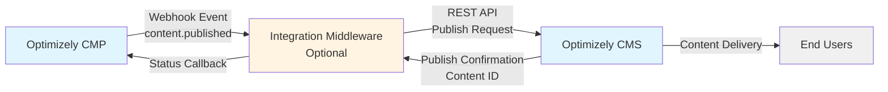
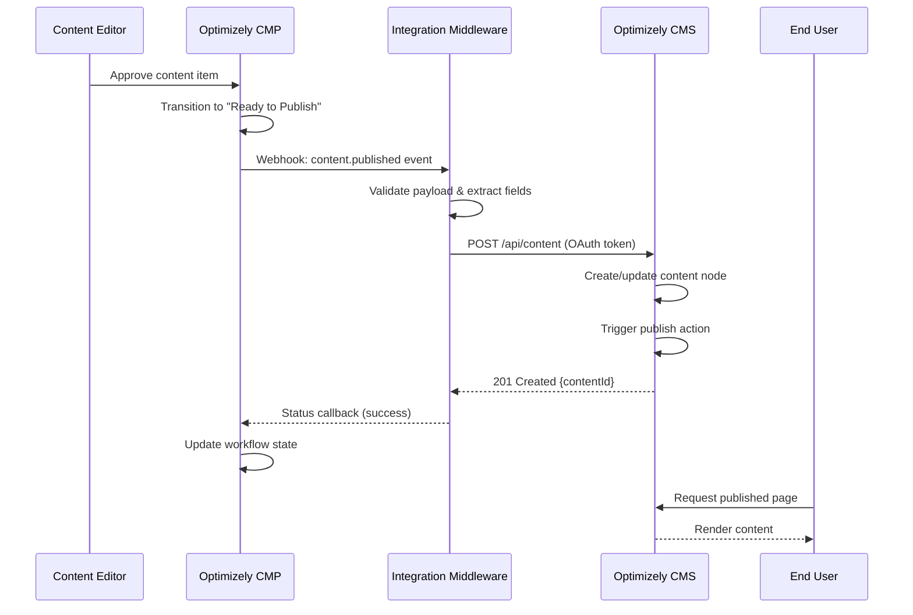

# Integration Specification: Optimizely CMP to Optimizely CMS

**Version:** 1.0  
**Last Updated:** April 22, 2026  
**Status:** Draft  
**Owner:** Marketing Operations / Web Platform Team

---

## 1. Executive Summary

This integration bridges the editorial planning and content production workflow by enabling content approved within Optimizely Content Marketing Platform (CMP) to be automatically published into Optimizely CMS, eliminating the manual handoff step where content managers would otherwise need to copy, reformat, and republish assets between systems.

**Key Benefits:**
- Eliminates workflow fragmentation between content planning and publishing
- Reduces time-to-publish for approved content
- Maintains content fidelity and version control
- Reduces manual effort and human error in content synchronization
- Particularly valuable for high-volume editorial calendars and multi-brand content operations

---

## 2. Business Context

### 2.1 Business Problem

The core problem this integration solves is workflow fragmentation. Without this integration, content that is fully approved and signed off in CMP still requires redundant manual effort to reach the live site, introducing:
- Publication delays
- Version mismatch risks
- Human error in content transfer
- Operational bottlenecks in high-volume editorial workflows

### 2.2 Business Stakeholders

| Stakeholder Group | Role | Primary Interest |
|-------------------|------|------------------|
| Content Strategy & Editorial Teams | Content Lifecycle Owners | Reliability and timeliness of publish workflows |
| Digital Marketing / Demand Generation Leadership | Campaign Coordination | Accurate and on-schedule campaign content publication |
| Web Platform / Digital Experience Team | CMS Environment Owners | API configuration, content model alignment, publish event handling |
| Marketing Operations | Integration Owner | Bridge between editorial process requirements and technical delivery |
| Legal & Brand Governance | Compliance Oversight | Ensuring only fully approved content is published |

### 2.3 Business Requirements

**Business Requirements Documentation:**  
Requirements are distributed across editorial workflow specifications, content governance policies, and Optimizely CMP implementation documentation. Formal BRD consolidation may be needed through stakeholder interviews with editorial, MarTech, and platform engineering teams.

**Key Business Requirements:**
- Content approved in CMP must trigger automatic publish to CMS
- Only content reaching terminal approval state should be publishable
- Content must maintain fidelity through the transfer process
- Integration must support scheduled publishing workflows
- Editorial provenance (author, reviewer) must be preserved

---

## 3. Systems Overview

### 3.1 Source System

**System:** Optimizely Content Marketing Platform (CMP)  
**Description:** Editorial planning and content production hub (formerly Welcome)  
**Role:** Content creation, review, and approval through structured workflows  
**Deployment:** SaaS-hosted by Optimizely

**Environments:**
- Development
- Integration/QA
- Staging/Pre-production
- Production

### 3.2 Target System

**System:** Optimizely CMS (Content Cloud)  
**Version:** CMS 12 on .NET 6+ stack (confirm if CMS 11 legacy)  
**Description:** Digital experience delivery layer  
**Role:** Content rendering and publication to end-user channels  
**API:** Content Delivery API and Content Management API (headless-friendly in CMS 12)

**Environments:**
- Development
- Integration/QA
- Staging/Pre-production
- Production

**Deployment Model:** TBD — Confirm if DXP (Optimizely managed cloud), self-hosted, or other cloud hosting

**Tenant Architecture:** TBD — Confirm whether both systems share the same Optimizely One tenant or operate as independently provisioned instances

---

## 4. Integration Architecture

### 4.1 Integration Pattern

**Pattern:** Event-driven pub/sub architecture with optional iPaaS middleware layer

**Approach:**
- CMP acts as publisher, emitting content lifecycle events (content approved, ready-to-publish)
- CMS acts as subscriber, consuming events to trigger structured content ingestion
- Fundamentally unidirectional: content flows from CMP (authoring source of truth) to CMS (delivery runtime)
- Lightweight status callback from CMS to CMP confirms successful publish

**Implementation Options:**
1. **Direct point-to-point:** Optimizely native webhook/API capabilities for low-complexity scenarios
2. **iPaaS middleware:** Azure Logic Apps, MuleSoft, AWS EventBridge, or Boomi for enterprise deployments requiring governance, retry logic, and multi-system fan-out

### 4.2 Data Flow Direction

**Primary Flow:** One-way (CMP → CMS)
- Content originates in CMP, pushed downstream to CMS upon approval
- Lightweight request-response acknowledgment returns CMS-assigned content ID
- No reverse synchronization of CMS content edits back to CMP (unless versioning workflow explicitly in scope)

### 4.3 Architecture Diagram



---

## 5. Integration Specifications

### 5.1 Protocol & Transport

**Primary Protocol:** REST API over HTTPS  
**Event Mechanism:** Optimizely CMP native webhooks  
**Message Format:** JSON

**Transport Pattern:**
- CMP emits webhook notification when content reaches publishable workflow state
- Webhook delivers JSON payload to configured endpoint
- Optional: Message queue (Azure Service Bus, AWS SQS) for resilience and retry guarantees

### 5.2 Authentication & Authorization

**Authentication Method:** OAuth 2.0 with client credentials flow

**Configuration Requirements:**
- CMS must expose OAuth 2.0 token endpoint
- CMP configured with OAuth client (client ID and secret)
- OAuth client granted Content Editor or Administrator role in CMS
- Token scope must include content write operations

**Token Endpoint:** TBD — Confirm CMS OAuth token URL  
**Shared Identity:** TBD — Confirm if systems sit within managed Optimizely One environment with shared identity context

### 5.3 Endpoints

**CMP Webhook Trigger:**
- Event: `content.published` or equivalent workflow status transition
- Configuration: TBD — CMP webhook configuration details

**CMS Ingestion Endpoint:**
- TBD — Confirm Optimizely CMS Content Management API endpoint for content creation/publish
- Expected format: `POST /api/episerver/v3.0/content` or similar

### 5.4 Message Flow



---

## 6. Data Specifications

### 6.1 Data Objects

**Primary Entity:** Content Item

**Supporting Entities:**
- Content metadata (taxonomy tags, categories, publication schedules, workflow status)
- Asset references (images, videos, documents from DAM layer)
- User attribution data (author, editor, reviewer identifiers)
- SEO metadata
- Localization data (if multi-language in scope)

### 6.2 Field-Level Data Mapping

| Source Field (CMP) | Source Type | Target Field (CMS) | Target Type | Transformation | Notes |
|-------------------|-------------|-------------------|-------------|----------------|-------|
| `payload.contentId` | string | `externalId` | string | Direct | Correlation key for idempotency |
| `payload.title` | string | `name` | string | Direct | Content headline |
| `payload.slug` | string | `urlSegment` | string | Direct | URL-friendly identifier |
| `payload.contentType` | string | `contentType` | string | Mapping table | Maps CMP content types to CMS content type IDs |
| `payload.language` | string | `language` | string | ISO code | e.g., en-US → en |
| `payload.body` | string (HTML) | `mainBody` | XhtmlString | HTML validation | Confirm if CMS expects HTML or structured blocks |
| `payload.excerpt` | string | `teaserText` | string | Direct | |
| `payload.tags` | array[string] | `categories` | CategoryList | Tag resolution | Map tags to CMS category IDs |
| `payload.categories` | array[string] | `primaryCategory` | Category | First match | Map to CMS taxonomy |
| `payload.author.name` | string | `author` | string | Direct | |
| `payload.author.email` | string | `authorEmail` | string | Direct | |
| `payload.seoMetadata.metaTitle` | string | `metaTitle` | string | Direct | Max 60 characters |
| `payload.seoMetadata.metaDescription` | string | `metaDescription` | string | Direct | Max 160 characters |
| `payload.seoMetadata.canonicalUrl` | string | `canonicalUrl` | string | Direct | |
| `payload.featuredImage.url` | string | `teaserImage` | ContentReference | Asset resolution | Resolve DAM URL to CMS media reference |
| `payload.featuredImage.altText` | string | `teaserImageAltText` | string | Direct | |
| `payload.workflow.approvedBy` | string | `publishedBy` | string | User lookup | Map CMP user ID to CMS user |
| `payload.workflow.approvedAt` | ISO 8601 | `publishedDate` | DateTime | Direct | |
| `payload.publishSchedule.publishAt` | ISO 8601 | `startPublish` | DateTime | Timezone conversion | Convert to UTC |
| `payload.publishSchedule.expiresAt` | ISO 8601 | `stopPublish` | DateTime | Timezone conversion | Null if not set |
| `payload.status` | string | N/A | N/A | Validation only | Must be "approved" to trigger publish |
| `payload.workflow.campaignId` | string | `campaignReference` | string | Direct (custom property) | Traceability field |

**Conditional Mappings:**
- If `payload.localizations` array present, create localized content variants
- If `payload.targetChannels` includes "cms-blog", set CMS content location accordingly

### 6.3 Sample Payloads

**CMP Webhook Event (Source):**

```json
{
  "event": "content.published",
  "timestamp": "2024-11-14T10:32:00Z",
  "source": "optimizely-cmp",
  "payload": {
    "contentId": "cmp-98712",
    "title": "5 Ways to Maximize Your Q4 Campaign ROI",
    "slug": "maximize-q4-campaign-roi",
    "status": "approved",
    "contentType": "blog_post",
    "language": "en-US",
    "author": {
      "id": "usr-441",
      "name": "Jane Holloway",
      "email": "j.holloway@company.com"
    },
    "body": "<p>As Q4 approaches, marketing teams...</p>",
    "excerpt": "A practical guide to driving ROI in Q4.",
    "tags": ["marketing", "ROI", "Q4", "campaigns"],
    "categories": ["Marketing Strategy"],
    "seoMetadata": {
      "metaTitle": "Maximize Q4 Campaign ROI | Company Blog",
      "metaDescription": "Learn five proven strategies to maximize your Q4 campaign ROI.",
      "canonicalUrl": "https://www.company.com/blog/maximize-q4-campaign-roi",
      "focusKeyword": "Q4 campaign ROI"
    },
    "featuredImage": {
      "assetId": "asset-5521",
      "url": "https://cdn.company.com/images/q4-roi-hero.jpg",
      "altText": "Team reviewing Q4 campaign performance charts",
      "mimeType": "image/jpeg",
      "width": 1920,
      "height": 1080
    },
    "workflow": {
      "approvedBy": "usr-102",
      "approvedAt": "2024-11-14T09:55:00Z",
      "campaignId": "camp-2024-Q4-001"
    },
    "publishSchedule": {
      "publishAt": "2024-11-15T08:00:00Z",
      "timezone": "America/New_York",
      "expiresAt": null
    },
    "targetChannels": ["cms-website", "cms-blog"]
  }
}
```

**CMS API Request (Target):**

```json
{
  "contentType": ["BlogPost"],
  "name": "5 Ways to Maximize Your Q4 Campaign ROI",
  "urlSegment": "maximize-q4-campaign-roi",
  "language": {
    "name": "en"
  },
  "externalId": "cmp-98712",
  "status": "Published",
  "startPublish": "2024-11-15T13:00:00Z",
  "stopPublish": null,
  "author": "Jane Holloway",
  "authorEmail": "j.holloway@company.com",
  "mainBody": "<p>As Q4 approaches, marketing teams...</p>",
  "teaserText": "A practical guide to driving ROI in Q4.",
  "metaTitle": "Maximize Q4 Campaign ROI | Company Blog",
  "metaDescription": "Learn five proven strategies to maximize your Q4 campaign ROI.",
  "canonicalUrl": "https://www.company.com/blog/maximize-q4-campaign-roi",
  "categories": ["Marketing Strategy"],
  "tags": ["marketing", "ROI", "Q4", "campaigns"],
  "teaserImage": {
    "url": "https://cdn.company.com/images/q4-roi-hero.jpg"
  },
  "teaserImageAltText": "Team reviewing Q4 campaign performance charts",
  "campaignReference": "camp-2024-Q4-001",
  "publishedDate": "2024-11-14T09:55:00Z"
}
```

**CMS API Response:**

```json
{
  "contentLink": {
    "id": 12345,
    "workId": 0,
    "guidValue": "a3f2e1d4-5b6c-7a8d-9e0f-1a2b3c4d5e6f"
  },
  "name": "5 Ways to Maximize Your Q4 Campaign ROI",
  "language": {
    "name": "en"
  },
  "status": "Published",
  "created": "2024-11-14T10:32:15Z",
  "saved": "2024-11-14T10:32:15Z",
  "startPublish": "2024-11-15T13:00:00Z"
}
```

---

## 7. Non-Functional Requirements

### 7.1 Performance

**Latency:**
- Target: 30 seconds to 2 minutes end-to-end (CMP approval → CMS availability)
- Acceptable: Near-real-time to short-batch

**Throughput:**
- Baseline: 50-500 content publish events per day
- Peak burst capacity: 50-200 concurrent publish events
- Peak windows: Morning editorial standup, scheduled publication embargoes

**Payload Size:**
- Individual content payloads: 10KB to 500KB per asset
- Includes rich text, metadata, and associated media references

### 7.2 Availability

**Uptime SLA:** 99.5% to 99.9% during business hours

**Degraded Mode Behavior:**
- If CMS endpoint temporarily unavailable, queue unpublished content for retry
- Implement message broker (Azure Service Bus, AWS SQS) for resilience

**Hard Deadlines:**
- TBD — Confirm if scheduled content go-live (campaign launches) impose stricter latency requirements

### 7.3 Data Volume & Frequency

**Volume:** 50 to 500 content publish events per day

**Frequency:** Event-driven (triggered at discrete workflow milestones)

**Batch Processing:** Nightly reconciliation sync recommended as safety net

**Concurrent Processing:** Design for burst rates of 20-30 concurrent events without queuing delays

### 7.4 Error Handling & Retry Strategy

**Transient Failures:**
- **Triggers:** CMS API timeouts, network interruptions, temporary service unavailability
- **Strategy:** Exponential backoff retry
- **Initial delay:** 30 seconds
- **Max delay:** 15 minutes
- **Max attempts:** 5
- **Escalation:** Route to dead-letter queue after max retries

**Permanent Failures:**
- **Triggers:** Validation errors, schema mismatches, unauthorized content states
- **Strategy:** No retry, immediate alert
- **Notification:** Email alert or monitoring dashboard (Datadog, Splunk)
- **Action:** Editorial team investigation required

**Idempotency:**
- Use CMP content asset ID + version number as idempotency key
- Prevent duplicate content entries on retry
- CMS must handle duplicate publish requests gracefully

**Event Persistence:**
- Store failed events with full payload, error code, timestamp, retry count
- Enable manual reprocessing and audit traceability

**Webhook Acknowledgment:**
- Integration middleware returns 2xx acknowledgment to CMP immediately
- All retry logic handled asynchronously downstream
- Prevents webhook timeout-induced duplicate triggers

### 7.5 Security

**Data in Transit:** TLS 1.2 or higher for all API communication

**Authentication:** OAuth 2.0 with client credentials flow

**Authorization:**
- Service account must have Content Editor or Administrator role
- Principle of least privilege for API access
- Regular credential rotation policy: TBD

**Secrets Management:** TBD — Confirm if using Azure Key Vault, AWS Secrets Manager, or equivalent

**Network Security:** TBD — Confirm if IP whitelisting or VPN required for CMS access

---

## 8. Constraints, Assumptions, and Risks

### 8.1 Assumptions

1. **Tenant Architecture:** Assumes CMP and CMS share the same organizational instance or are connected via Optimizely-native integration pathway
2. **Content Graph:** Assumes content can flow through platform's built-in content graph or API layer rather than requiring custom middleware
3. **Rich Media:** Assumes DAM references/embedded asset URLs may require separate resolution logic to ensure content renders correctly post-publish
4. **Terminal State:** Assumes CMP workflow has well-defined terminal "approved" state that gates publish trigger

### 8.2 Constraints

1. **Schema Mismatch:** CMP structures content around campaign briefs, tasks, and editorial workflows, while CMS expects fully resolved, publishable content types — field mapping requires careful design
2. **Optional Fields:** Must accommodate optional or conditional fields that exist in one system but not the other
3. **Rate Limiting:** Optimizely CMS Content Management API has rate limits — must plan for throttling, especially in bulk publish scenarios
4. **Content Type Complexity:** CMS content type inheritance and field cardinality must be validated against CMP source schema

### 8.3 Known Risks

| Risk | Impact | Likelihood | Mitigation |
|------|--------|------------|------------|
| Content published before terminal approval state | High — Non-compliant content on production | Medium | Tightly couple integration trigger to CMP workflow status events; validate approval state |
| Content schema mismatch (field mapping errors) | High — Content rendering failures | High | Formal field mapping specification; validation testing in non-prod environments |
| DAM asset references unresolvable in CMS | Medium — Content displays without images | Medium | Coordinate asset sync process; validate asset URLs during transformation |
| API rate limiting during bulk publish | Medium — Publish delays | Medium | Implement request throttling; use message queue for buffering |
| Duplicate publish events on webhook retry | Low — Duplicate content nodes | Low | Implement idempotency keys; CMS-side duplicate detection |
| Middleware outage | High — Publish workflow disruption | Low | Message queue with dead-letter handling; monitoring and alerting |

---

## 9. Testing Strategy

### 9.1 Test Scenarios

**Functional Tests:**
- Single content item publish (happy path)
- Bulk publish (burst scenario)
- Scheduled publish (future publication date)
- Content update (republish existing content)
- Multi-language content publish
- Content with rich media references
- Content with all optional fields populated
- Content with minimal required fields only

**Error Scenarios:**
- CMS API timeout (transient failure)
- CMS API 4xx validation error (permanent failure)
- Invalid OAuth token (authentication failure)
- Schema validation failure
- Missing required fields
- Webhook delivery failure
- Duplicate publish event (idempotency test)

**Non-Functional Tests:**
- Latency measurement (end-to-end timing)
- Throughput test (concurrent publish events)
- Retry behavior validation
- Dead-letter queue handling
- Monitoring and alerting validation

### 9.2 Test Data

**Test Content Items:**
- TBD — Prepare sample content items in non-production CMP environments
- Include variety of content types (blog posts, landing pages, articles)
- Include edge cases (very long content, special characters, null optional fields)

**Test Environments:**
- Development → Development integration testing
- Integration/QA → Full regression testing
- Staging → Pre-production validation with production-like data volumes

---

## 10. Monitoring & Observability

### 10.1 Key Metrics

**Integration Health:**
- Publish success rate (%)
- Average end-to-end latency (seconds)
- Events in retry queue (count)
- Events in dead-letter queue (count)
- API error rate by status code (%)

**Business Metrics:**
- Content items published per day (count)
- Time from CMP approval to CMS availability (minutes)
- Failed publish events requiring manual intervention (count)

### 10.2 Logging

**Required Log Events:**
- Webhook received from CMP (with contentId, timestamp)
- Payload validation result
- CMS API request initiated
- CMS API response received (with status code, contentId)
- Retry attempts (with attempt number, delay)
- Error events (with full payload and error details)
- Dead-letter queue routing

**Log Retention:** TBD — Confirm organizational logging retention policy

### 10.3 Alerting

**Alert Triggers:**
- Dead-letter queue threshold exceeded (e.g., > 5 failed events)
- CMS API error rate > 5% over 15-minute window
- End-to-end latency > 5 minutes
- Integration middleware service unavailable
- OAuth token refresh failure

**Alert Channels:** TBD — Confirm alert routing (email, Slack, PagerDuty, etc.)

### 10.4 Dashboards

**Recommended Visualizations:**
- Publish volume over time (line chart)
- Success vs. failure rate (stacked bar chart)
- End-to-end latency distribution (histogram)
- Retry queue depth (gauge)
- Top error codes (table)

**Monitoring Tools:** TBD — Confirm if Datadog, Splunk, Application Insights, or other monitoring platform

---

## 11. Deployment Plan

### 11.1 Deployment Approach

**Phase 1: Development & Integration Testing**
- Configure CMP webhooks in dev environment
- Implement field mapping and transformation logic
- Deploy to dev CMS instance
- Execute functional test scenarios

**Phase 2: QA Validation**
- Deploy to QA/Integration environment
- Execute full regression test suite
- Validate error handling and retry behavior
- Performance testing with simulated load

**Phase 3: Staging Pre-Production**
- Deploy to staging environment
- Conduct user acceptance testing with editorial team
- Validate with production-like data volumes
- Final security and compliance review

**Phase 4: Production Rollout**
- TBD — Confirm if phased rollout or full cutover
- Options: Blue-green deployment, canary release, or direct production deployment
- Recommend starting with low-risk content types before enabling all workflows

### 11.2 Rollback Plan

**Rollback Triggers:**
- Publish success rate < 95% for 30+ minutes
- Critical data corruption detected
- CMS performance degradation attributed to integration

**Rollback Procedure:**
- Disable CMP webhook configuration
- Route new publish events to holding queue
- Revert middleware deployment if applicable
- Manually publish urgent content until issue resolved

---

## 12. Operations & Maintenance

### 12.1 Runbook

**Common Operational Tasks:**
- Reprocess failed publish event from dead-letter queue
- Manually trigger publish for specific content item
- Validate OAuth token refresh
- Clear retry queue
- Rotate service credentials

**Escalation Contacts:**
- Integration Owner: TBD
- CMP Support: TBD
- CMS Support: TBD
- Infrastructure/Platform Team: TBD

### 12.2 Maintenance Windows

**Scheduled Maintenance:** TBD — Align with organizational change control windows

**Impact During Maintenance:**
- CMP events queued during CMS maintenance
- Automatic retry once CMS available
- No data loss expected

### 12.3 Documentation

**Required Documentation:**
- Field mapping specification (detailed version of section 6.2)
- OAuth configuration guide
- Monitoring dashboard access
- Runbook with troubleshooting procedures
- Incident response playbook

---

## 13. Open Questions & Next Steps

### 13.1 Open Questions

1. **CMS Version & Deployment:** Confirm exact CMS version (12 vs. 11) and deployment model (DXP, self-hosted, other)
2. **Tenant Architecture:** Confirm if CMP and CMS share Optimizely One tenant or are independently provisioned
3. **Middleware Decision:** Confirm if iPaaS middleware will be used or direct API integration
4. **CMS API Endpoints:** Provide exact CMS Content Management API endpoint URLs for each environment
5. **OAuth Configuration:** Provide OAuth token endpoint URL and client provisioning process
6. **Secrets Management:** Confirm organizational standard for secrets storage (Key Vault, Secrets Manager, etc.)
7. **Network Security:** Confirm if IP whitelisting or VPN required for CMS access
8. **Monitoring Platform:** Confirm monitoring and alerting tooling (Datadog, Splunk, Application Insights, etc.)
9. **Alert Routing:** Confirm alert notification channels and on-call rotation
10. **Deployment Strategy:** Confirm production rollout approach (phased vs. full cutover)
11. **Business Requirements Documentation:** Consolidate distributed requirements into formal BRD
12. **Field Mapping Details:** Produce detailed field mapping specification with all custom fields
13. **Test Data:** Prepare sample content items in non-production environments
14. **Rollout Content Types:** Confirm which content types will be in initial scope

### 13.2 Next Steps

1. **Discovery Session:** Schedule technical discovery with CMS platform team to validate endpoints and OAuth setup
2. **Field Mapping Workshop:** Conduct field mapping session with CMP content team and CMS configuration owners
3. **Architecture Decision:** Finalize middleware vs. direct API integration approach
4. **Test Environment Setup:** Configure CMP webhooks in dev environment
5. **Development Kickoff:** Begin implementation of transformation logic and API integration
6. **Documentation:** Produce detailed field mapping specification document
7. **Monitoring Setup:** Configure dashboards and alerts in selected monitoring platform

---

## 14. Approval & Sign-Off

| Role | Name | Date | Signature |
|------|------|------|-----------|
| Business Owner | TBD | | |
| Solution Architect | TBD | | |
| Integration Owner | TBD | | |
| CMS Platform Owner | TBD | | |
| Security Reviewer | TBD | | |

---

## Document History

| Version | Date | Author | Changes |
|---------|------|--------|---------|
| 1.0 | April 22, 2026 | GitHub Copilot | Initial specification based on stakeholder requirements gathering |