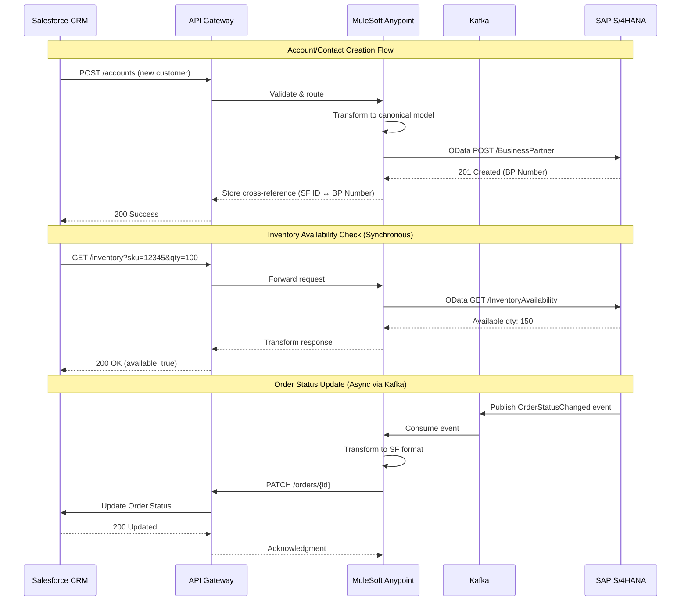
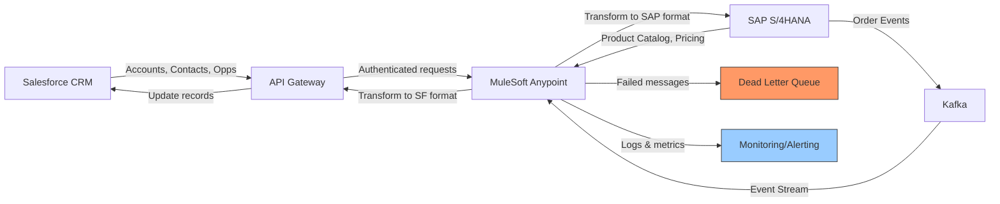

# Integration Spec: Salesforce → SAP S/4HANA

| Field              | Value                        |
|--------------------|------------------------------|
| **Spec Version**   | 1.0                          |
| **Status**         | Draft                        |
| **Author**         | Integration Team             |
| **Last Updated**   | April 22, 2026               |
| **Reviewers**      | TBD                          |

---

## 1. Overview

### 1.1 Business Purpose

This integration synchronizes customer master data and order lifecycle events between the Salesforce CRM platform and the SAP S/4HANA ERP system, eliminating the manual rekeying process that currently requires the sales operations team to duplicate approximately 300–500 records per week across both systems. The core business problem being solved is data latency and inconsistency: sales representatives are quoting against stale inventory and pricing data in Salesforce, while the finance and fulfillment teams in SAP are operating on incomplete or delayed customer information, leading to order processing errors and delayed revenue recognition.

By establishing a real-time, bidirectional sync for account, contact, and order data, the integration enables a single source of truth across the commercial and operational sides of the business. The expected business outcomes include:
- Reduction in order-to-cash cycle time
- Elimination of duplicate data entry effort estimated at roughly 1.5 FTE annually
- Improved forecast accuracy by ensuring CRM pipeline data reflects actual SAP order confirmations
- Foundation for a planned customer self-service portal initiative scheduled for Q3

### 1.2 Systems Involved

| Role       | System                          | Version              | Owner / Team           |
|------------|---------------------------------|----------------------|------------------------|
| Source     | Salesforce CRM                  | Enterprise Edition   | Sales Operations       |
| Target     | SAP S/4HANA                     | 2022 SP03            | Finance & Operations   |
| Middleware | MuleSoft Anypoint Platform      | 4.4 (CloudHub 2.0)   | Integration Team       |
| Messaging  | Apache Kafka                    | Latest               | Platform Engineering   |

### 1.3 Integration Pattern

Hub-and-spoke architecture leveraging MuleSoft Anypoint Platform as the central integration broker with canonical data models and centralized error handling. Supplemented by pub/sub pattern using Apache Kafka for high-frequency order status event streaming between fulfillment engine and customer notification services.

### 1.4 Data Flow Direction

**Bidirectional, asymmetric:**
- **Salesforce → SAP:** Customer Accounts, Contacts, Opportunities, Quotes (triggering order creation)
- **SAP → Salesforce:** Order Status, Order Line Items, Inventory Availability, Invoice Data, Product Catalog, Pricing, Tax Codes, Payment Terms
- **Synchronous Request-Response:** Inventory availability checks at quote creation (SF queries SAP for real-time stock confirmation)
- **Scheduled Batch:** Product Catalog and reference data sync during off-peak hours

---

## 2. Business Requirements

### 2.1 Functional Requirements

- Real-time synchronization of customer account and contact data from Salesforce to SAP to eliminate manual data entry
- Bidirectional order lifecycle event synchronization to maintain consistent view across sales and operations
- Synchronous inventory availability check capability for sales reps during quote creation
- Automated product catalog and pricing synchronization from SAP (system of record) to Salesforce
- Support for multi-currency orders and partial shipment scenarios
- Maintain referential integrity for supporting reference data (tax codes, payment terms, shipping addresses)
- Field-level encryption or masking for PII data transiting the middleware layer per data classification policy

### 2.2 Business Rules

- SAP is the system of record for customer master data and order financials; conflict resolution rules must prevent Salesforce from overwriting canonical ERP data
- Sales representatives cannot commit delivery dates without confirmed inventory availability from SAP
- Order status updates from SAP must reflect in Salesforce within defined SLA to maintain forecast accuracy
- Product catalog and pricing data must be synchronized from SAP to ensure single source of truth for quotes
- Custom Salesforce picklist values with no direct SAP equivalent require default value rules and business sign-off

### 2.3 Stakeholders

| Name                          | Role                            | Responsibility                                    |
|-------------------------------|---------------------------------|---------------------------------------------------|
| VP of Sales / CRO             | Executive Sponsor               | CRM system owner, business outcomes               |
| CFO / VP of Finance           | Executive Sponsor               | ERP system owner, order-to-cash accuracy          |
| Head of IT                    | Technical Governance            | Architecture oversight, infrastructure approval   |
| Sales Operations Manager      | Business Owner                  | Define CRM data flows and validation rules        |
| Finance Operations Manager    | Business Owner                  | Define ERP data flows and reconciliation windows  |
| Customer Success Lead         | End User Representative         | Impact assessment on order visibility             |
| Enterprise Architect          | Technical Lead                  | Integration pattern design and standards          |

---

## 3. Technical Requirements

### 3.1 Endpoints

| System               | Environment | Base URL / Connection String                              | Notes                                    |
|----------------------|-------------|-----------------------------------------------------------|------------------------------------------|
| Salesforce           | DEV         | https://dev-org.my.salesforce.com                         | Sandbox environment                      |
| Salesforce           | UAT         | https://uat-org.my.salesforce.com                         | Full copy sandbox                        |
| Salesforce           | PROD        | https://production-org.my.salesforce.com                  | Production instance, US-East region      |
| SAP S/4HANA          | DEV         | sap-dev.corp.internal:8000                                | On-premise, Chicago DC                   |
| SAP S/4HANA          | QA          | sap-qa.corp.internal:8000                                 | On-premise, Chicago DC                   |
| SAP S/4HANA          | PROD        | sap-prod.corp.internal:8000                               | On-premise, IBM Power cluster            |
| MuleSoft CloudHub    | Non-Prod    | https://nonprod-integration.us-e1.cloudhub.io             | Mule 4 runtime                           |
| MuleSoft CloudHub    | PROD        | https://prod-integration.us-e1.cloudhub.io                | Mule 4 runtime                           |
| Apache Kafka         | All         | kafka-cluster.corp.internal:9092                          | Event streaming for order status         |

### 3.2 Protocol & Transport

- **Primary Transport:** REST APIs over HTTPS
- **Salesforce:** 
  - Bulk API 2.0 for high-volume record synchronization
  - Standard REST API for real-time, event-driven updates on individual records
- **SAP S/4HANA:** 
  - OData v4 services via SAP Integration Suite (Cloud Integration) as canonical interface layer
  - BAPIs and IDocs for order creation and fulfillment processes
- **Asynchronous Messaging:** Apache Kafka for high-frequency order status events to ensure decoupled, durable delivery
- **API Gateway:** Centralized routing, authentication, rate limiting, and observability
- **Note:** File-based SFTP ruled out due to latency requirements; available only as fallback for bulk historical data loads during initial migration

### 3.3 Authentication & Authorization

| Property                      | Value                                                                                      |
|-------------------------------|--------------------------------------------------------------------------------------------|
| **Auth Method**               | OAuth 2.0 with Client Credentials grant flow                                               |
| **Token Endpoint**            | Salesforce: `/services/oauth2/token`<br>SAP: `/oauth2/token` via SAP Integration Suite    |
| **Scopes / Roles**            | Minimum required permissions per principle of least privilege                              |
| **Token Management**          | MuleSoft Anypoint handles acquisition, caching, and refresh lifecycle                      |
| **Webhook Security**          | HMAC signature validation on Salesforce webhook callbacks to prevent spoofing              |
| **Credential Storage**        | HashiCorp Vault with 90-day rotation policy                                                |
| **Known Issue**               | SAP OData services in lower environments currently use Basic Auth; remediation required before production cutover |

### 3.4 Rate Limits & Throttling

- **Salesforce Bulk API 2.0:** 10,000 records per batch, max 100 batches/day per license tier
- **Salesforce REST API:** 15,000 calls/24 hours per license (Enterprise Edition)
- **SAP BAPI/IDoc:** Known throughput limitations during peak order processing windows (month-end close cycles); requires rate throttling in integration layer to prevent backpressure
- **MuleSoft CloudHub:** Sized for 1,200 transactions/minute with 3x burst capacity headroom for month-end spikes
- **Kafka:** Configured for sustained 15,000 inventory delta messages/day with 5-minute polling intervals

---

## 4. Integration Approach

### 4.1 Architecture Overview

The integration employs a hybrid hub-and-spoke architecture with MuleSoft Anypoint Platform serving as the central orchestration and transformation layer. The platform bridges Salesforce CRM (cloud) with SAP S/4HANA (on-premise) using a mix of:

- **CloudHub 2.0:** Mule 4 runtime instances handling synchronous REST-based flows and asynchronous messaging via Anypoint MQ
- **On-Premise Mule Runtimes:** Deployed within DMZ for legacy ERP connectivity
- **Apache Kafka:** Decoupled event streaming for order status updates and inventory changes
- **API Gateway:** Centralized authentication, rate limiting, telemetry, and request/response transformation

Canonical data models are maintained in MuleSoft to abstract source/target schema differences. Data transformations (DataWeave scripts) handle field mapping, type conversions, and business logic. Error handling follows tiered retry strategy with dead-letter queue persistence.

**Dependency:** MuleSoft Anypoint infrastructure assumed operational with production and non-production CloudHub environments provisioned. SAP Basis team availability required for RFC configuration and transport approvals.

### 4.2 Sequence Diagram



### 4.3 Data Flow Diagram



### 4.4 Assumptions

- MuleSoft Anypoint Platform is already licensed and operational with production and non-production CloudHub environments provisioned
- Salesforce Bulk API 2.0 and standard REST API are available and accessible via Named Credentials
- SAP OData v4 services are exposed via SAP Integration Suite with adequate performance characteristics
- Kafka cluster is provisioned and managed by Platform Engineering with defined retention policies
- Business stakeholders can provide field-level mapping sign-off within 2 sprints
- SAP Basis team can provision RFC users and configure transport approvals within SLA
- Initial data migration/backfill strategy is out of scope for real-time integration; separate ETL process assumed

### 4.5 Constraints

- SAP system treated as system of record for customer master and order financials; Salesforce cannot override canonical ERP data
- Change freeze schedules for Salesforce and SAP production environments are not aligned; release coordination required
- On-premise SAP connectivity requires VPN/DMZ traversal; latency implications for synchronous API calls
- PII handling must comply with data classification policy; field-level encryption or masking required before data transits middleware
- SAP BAPI/IDoc throughput limitations during month-end close cycles; rate throttling mandatory to prevent cascading failures
- Dependency on third-party API credentials and SAP basis team availability represents scheduling risk

### 4.6 Known Risks

| Risk                                           | Impact | Mitigation                                                                                     |
|------------------------------------------------|--------|------------------------------------------------------------------------------------------------|
| SAP OData services use Basic Auth in non-prod  | High   | Remediation task logged to migrate to OAuth 2.0 before production cutover                      |
| BAPI throughput limits during month-end close  | High   | Implement rate throttling and message queuing; schedule batch jobs during off-peak hours       |
| Salesforce/SAP production change freeze misalignment | Medium | Coordinate release windows 4 weeks in advance; maintain release calendar with both teams      |
| Azure Logic Apps sprawl bypassing MuleSoft governance | Medium | Consolidation initiative in Q3 to route all Logic Apps workflows through MuleSoft API layer   |
| Incomplete field mappings from SAP team        | Medium | Escalate to enterprise architect; schedule focused mapping review session with SAP team        |
| Dependency on SAP Basis team for RFC config    | Medium | Engage SAP Basis team early; build slack into project schedule for transport approval delays  |

---

## 5. Data Mapping

### 5.1 Entities Exchanged

**Salesforce → SAP:**
- Accounts (Customer Master)
- Contacts
- Opportunities
- Quotes

**SAP → Salesforce:**
- Orders (Sales Orders)
- Order Line Items
- Order Status Updates
- Inventory Availability
- Invoices
- Products (Material Master)
- Price Lists
- Tax Codes (Reference Data)
- Payment Terms (Reference Data)
- Shipping Addresses

**Synchronous (Request-Response):**
- Inventory Availability Check (Salesforce queries SAP at quote time)

### 5.2 Field-Level Mapping

**Entity: Account (Salesforce) → Business Partner (SAP)**

| # | Source Field          | Source Type | Target Field       | Target Type | Transformation                          | Required | Notes                                    |
|---|-----------------------|-------------|--------------------|-------------|-----------------------------------------|----------|------------------------------------------|
| 1 | Account.Id            | String(18)  | ExternalID         | String(50)  | Store for cross-reference               | Yes      | Salesforce GUID                          |
| 2 | Account.Name          | String(255) | OrganizationName   | String(100) | Truncate if > 100 chars                 | Yes      |                                          |
| 3 | Account.BillingStreet | String(255) | Street             | String(60)  | Concatenate street, city, state         | No       | Map to SAP address structure             |
| 4 | Account.BillingCity   | String(40)  | City               | String(40)  | Direct                                  | No       |                                          |
| 5 | Account.BillingState  | String(80)  | Region             | String(3)   | Lookup SAP region code                  | No       | Requires mapping table                   |
| 6 | Account.BillingPostalCode | String(20) | PostalCode     | String(10)  | Direct                                  | No       |                                          |
| 7 | Account.BillingCountry | String(80) | Country            | String(3)   | ISO country code lookup                 | Yes      | SF uses full name, SAP uses ISO-3166     |
| 8 | Account.Phone         | String(40)  | TelephoneNumber    | String(30)  | Strip formatting, keep digits only      | No       |                                          |
| 9 | Account.Industry      | Picklist    | IndustryCode       | String(4)   | Custom mapping table; default if unmapped | No    | TBD — requires business sign-off         |
| 10| Account.AnnualRevenue | Currency    | Revenue            | Decimal(15,2) | Convert to SAP base currency (USD)    | No       | Currency conversion required             |

**Entity: Order (SAP) → Order (Salesforce)**

| # | Source Field          | Source Type | Target Field       | Target Type | Transformation                          | Required | Notes                                    |
|---|-----------------------|-------------|--------------------|-------------|-----------------------------------------|----------|------------------------------------------|
| 1 | SalesOrder            | String(10)  | SAP_Order_Number__c | String(10) | Direct                                  | Yes      | Custom field in Salesforce               |
| 2 | SoldToParty           | String(10)  | AccountId          | String(18)  | Lookup SF Account via cross-reference   | Yes      | Requires ID mapping store                |
| 3 | OrderStatus           | String(2)   | Status             | Picklist    | Map SAP status codes to SF picklist     | Yes      | Requires status mapping table            |
| 4 | NetAmount             | Decimal(15,2) | Amount           | Currency    | Direct (assume same currency context)   | Yes      |                                          |
| 5 | RequestedDeliveryDate | Date        | RequestedDate__c   | Date        | Direct                                  | No       |                                          |
| 6 | ConfirmedDeliveryDate | Date        | ConfirmedDate__c   | Date        | Direct                                  | No       |                                          |

**TBD:** Complete field mappings for Contacts, Opportunities, Quotes, Order Line Items, Products, Pricing. SAP team to provide IDOC/BAPI field definitions by end of sprint.

### 5.3 Transformation Rules

- **ID Cross-Referencing:** Maintain bidirectional lookup table in MuleSoft for Salesforce Account.Id ↔ SAP BusinessPartner number
- **Currency Conversion:** Convert all currency fields to SAP base currency (USD) using exchange rates from SAP ERP
- **Country/Region Codes:** Map Salesforce full country names to ISO 3166-1 alpha-3 codes; map US state names to SAP region codes
- **Status Mapping:** SAP order status codes (e.g., 'A', 'B', 'C') map to Salesforce picklist values (e.g., 'Draft', 'Submitted', 'Confirmed')
- **Industry Code Mapping:** Custom Salesforce Industry picklist values to SAP 4-character industry codes; default value 'OTHR' if unmapped
- **Phone Number Normalization:** Strip all formatting characters, retain digits only with optional country code prefix
- **String Truncation:** Truncate source fields exceeding target max length with logging to DLQ for manual review
- **Null Handling:** SAP required fields with null SF values trigger validation error and route to DLQ; optional fields pass through as null
- **Multi-Currency Orders:** Preserve original currency code and converted amount; log discrepancies > 1% for reconciliation
- **Unit of Measure:** Map Salesforce UOM to SAP standard units (e.g., 'Each' → 'EA', 'Dozen' → 'DZ')

---

## 6. Sample Payloads

### 6.1 Request / Outbound Payload

**Salesforce Account → SAP Business Partner (JSON)**

```json
{
  "externalId": "001xx000003DGbYYAW",
  "organizationName": "Acme Corporation",
  "address": {
    "street": "123 Main Street",
    "city": "San Francisco",
    "region": "CA",
    "postalCode": "94105",
    "country": "USA"
  },
  "telephoneNumber": "4155551234",
  "industryCode": "TECH",
  "revenue": 5000000.00,
  "currency": "USD"
}
```

**Inventory Availability Request (Synchronous)**

```json
{
  "materialNumber": "MAT-12345",
  "plant": "1000",
  "requestedQuantity": 100,
  "requestedDate": "2026-05-15"
}
```

### 6.2 Response / Inbound Payload

**SAP Business Partner Creation Response**

```json
{
  "businessPartnerNumber": "BP0012345",
  "externalId": "001xx000003DGbYYAW",
  "status": "Created",
  "createdDate": "2026-04-22T10:30:00Z"
}
```

**Inventory Availability Response**

```json
{
  "materialNumber": "MAT-12345",
  "plant": "1000",
  "availableQuantity": 150,
  "confirmedDate": "2026-05-15",
  "available": true
}
```

**Order Status Update (Kafka Event)**

```json
{
  "eventType": "OrderStatusChanged",
  "eventTimestamp": "2026-04-22T14:45:30Z",
  "salesOrderNumber": "SO-987654",
  "externalOrderId": "006xx000003RfPTAA0",
  "previousStatus": "B",
  "newStatus": "C",
  "confirmedDeliveryDate": "2026-05-20",
  "trackingNumber": "1Z999AA10123456784"
}
```

### 6.3 Error Payload

**Validation Error (400 Bad Request)**

```json
{
  "errorCode": "VALIDATION_ERROR",
  "message": "Required field 'country' is missing or invalid",
  "timestamp": "2026-04-22T10:35:00Z",
  "correlationId": "550e8400-e29b-41d4-a716-446655440000",
  "details": [
    {
      "field": "address.country",
      "error": "Must be a valid ISO 3166-1 alpha-3 country code"
    }
  ]
}
```

**System Error (503 Service Unavailable)**

```json
{
  "errorCode": "SAP_UNAVAILABLE",
  "message": "SAP S/4HANA system temporarily unavailable",
  "timestamp": "2026-04-22T10:40:00Z",
  "correlationId": "550e8400-e29b-41d4-a716-446655440001",
  "retryAfter": 30
}
```

---

## 7. Error Handling

### 7.1 Error Scenarios

| Scenario                       | HTTP Status / Error Code | Handling Strategy                                                                          |
|--------------------------------|--------------------------|--------------------------------------------------------------------------------------------|
| Network timeout                | Timeout                  | Retry 3x with exponential backoff (2s, 4s, 8s); route to DLQ if all retries exhausted     |
| Rate limiting (429)            | 429 Too Many Requests    | Exponential backoff starting at 30s; respect Retry-After header if present                 |
| SAP service unavailable        | 503 Service Unavailable  | Retry 3x with exponential backoff (2s, 4s, 8s); alert operations if sustained > 5 min     |
| Invalid payload                | 400 Bad Request          | Fail fast, no retry; route to DLQ with full payload and error details for manual review   |
| Validation failure             | 422 Unprocessable Entity | Fail fast, no retry; route to DLQ; alert data steward for data correction upstream        |
| Authentication failure         | 401 Unauthorized         | Attempt token refresh; if refresh fails, alert integration team immediately                |
| Business rule violation        | Custom error code        | Route to DLQ with business error details; notify business owner for resolution             |
| Duplicate record (idempotency) | 409 Conflict             | Log and acknowledge (no retry); verify idempotency key and cross-reference mapping        |

### 7.2 Retry Strategy

| Property                     | Value                                                                                      |
|------------------------------|--------------------------------------------------------------------------------------------|
| **Max Retries**              | 3 attempts for transient errors (timeout, 429, 503)                                        |
| **Backoff Strategy**         | Exponential backoff: 2s, 4s, 8s (max 30s cap)                                             |
| **Retry Eligible Errors**    | Network timeout, HTTP 429, HTTP 503, connection refused                                    |
| **No Retry Errors**          | HTTP 400, 422, 401 (post-refresh), business validation failures                            |
| **Idempotency**              | Preserve idempotency keys on each message to prevent duplicate orders in SAP               |
| **Dead Letter Queue**        | MuleSoft Anypoint MQ DLQ for failed messages; Kafka DLQ for event stream failures          |
| **DLQ Retention**            | 7 days with full payload, error code, timestamp, correlation ID, stack trace               |
| **Manual Replay**            | Operations team can replay messages from DLQ via MuleSoft Anypoint console                 |

### 7.3 Alerting & Monitoring

- **Alerting Platform:** PagerDuty for critical incidents; Slack for warnings and informational alerts
- **Alert Triggers:**
  - DLQ depth exceeds 10 messages within 5-minute window → PagerDuty alert to integration on-call
  - SAP system unavailable (sustained HTTP 503) for > 5 minutes → PagerDuty alert to operations
  - Authentication failures (HTTP 401 post-refresh) → Immediate PagerDuty alert to integration team
  - Message processing latency exceeds SLA (> 500ms p95) for > 15 minutes → Slack warning
  - Kafka consumer lag exceeds 1000 messages → Slack warning; > 5000 → PagerDuty alert
- **Dashboards:** 
  - Real-time MuleSoft CloudHub monitoring dashboard showing throughput, latency, error rates
  - Kafka consumer lag and event processing metrics
  - Custom Grafana dashboard for end-to-end integration health (SF → MW → SAP)
- **Logging:** Centralized logs in Splunk with correlation IDs for transaction tracing across systems
- **Metrics:** Prometheus metrics exported from MuleSoft for alerting and historical analysis

---

## 8. Non-Functional Requirements

### 8.1 SLAs

| Metric                 | Target                                                                                     |
|------------------------|--------------------------------------------------------------------------------------------|
| **Availability**       | 99.9% during core business hours (6 AM–10 PM local time); ~8.7 hours allowable downtime/year |
| **Latency (p95)**      | < 500ms end-to-end for synchronous API calls; hard ceiling of 2 seconds before timeout    |
| **Latency (p99)**      | < 1 second for synchronous calls                                                           |
| **Throughput**         | 1,200 transactions/minute sustained; 3,600 TPS burst capacity for month-end spikes        |
| **Batch Processing**   | Product catalog sync completes within 2-hour maintenance window                            |
| **RTO**                | 15 minutes (Recovery Time Objective)                                                       |
| **RPO**                | 5 minutes (Recovery Point Objective)                                                       |
| **Planned Maintenance**| 2 hours every other Sunday, 2–4 AM local time                                              |

### 8.2 Data Volume & Frequency

| Property               | Value                                                                                      |
|------------------------|--------------------------------------------------------------------------------------------|
| **Trigger**            | Mixed: Event-driven (real-time), Scheduled (batch), On-demand (inventory check)            |
| **Real-Time Events**   | ~8,000 orders/day steady-state; peak 40,000–50,000/day during promotions (5x surge factor) |
| **Inventory Updates**  | 15,000 delta messages/day; 5-minute polling during business hours, 30-minute overnight     |
| **Product Catalog Sync** | Nightly batch; ~12,000 SKUs, estimated 50 MB payload size                                 |
| **Avg Order Payload**  | 4–8 KB JSON format                                                                         |
| **Peak Throughput**    | 50–60 MB/hour during high-traffic windows                                                  |
| **Historical Backfill**| Initial migration: ~500,000 accounts, out of scope for real-time integration               |
| **Growth Buffer**      | Middleware sized for 30% growth over next 18 months                                        |

### 8.3 Security & Compliance

- **Data Classification:** Customer PII classified as "Confidential"; order financial data classified as "Restricted"
- **PII Handling:** Field-level encryption or masking required before data transits middleware layer; compliance with GDPR and CCPA
- **Encryption in Transit:** TLS 1.2+ for all API communication; mutual TLS (mTLS) for SAP on-premise connectivity via VPN
- **Encryption at Rest:** All credentials stored in HashiCorp Vault with AES-256 encryption; DLQ messages encrypted at rest
- **Credential Rotation:** 90-day rotation policy for all service accounts, API keys, and OAuth client credentials
- **Audit Logging:** All API transactions logged with correlation IDs; retained for 12 months per compliance policy
- **Access Control:** Role-based access control (RBAC) for MuleSoft Anypoint console; SOD principles enforced
- **Regulatory Requirements:** SOX compliance for financial data flows; quarterly audit attestation required
- **Vulnerability Management:** Quarterly penetration testing of API endpoints; patch management for MuleSoft runtimes

---

## 9. Testing Strategy

### 9.1 Test Approach

- **Unit Testing:** DataWeave transformation scripts tested with representative datasets covering happy path, edge cases, and error scenarios
- **Integration Testing:** End-to-end flows validated in DEV/QA environments with mock data
- **Contract Testing:** API contract validation using Pact or similar framework to ensure schema compatibility across versions
- **Performance Testing:** Load testing with realistic transaction volumes (1,200 TPS sustained, 3,600 TPS burst) using JMeter or Gatling
- **Failover Testing:** Simulate SAP outages, network failures, and authentication errors to validate retry and DLQ handling
- **Data Validation:** Automated comparison of source vs. target records post-sync to verify transformation accuracy
- **UAT:** Business stakeholders validate end-to-end scenarios in UAT environment with production-like data

### 9.2 Test Scenarios

| # | Scenario                              | Input                                    | Expected Output                              | Type        |
|---|---------------------------------------|------------------------------------------|----------------------------------------------|-------------|
| 1 | Create new account in SF              | Valid SF Account record                  | BP created in SAP with cross-reference stored | Integration |
| 2 | Sync account with missing country     | Account without billing country          | 400 error, routed to DLQ                     | Negative    |
| 3 | Inventory check - available           | SKU MAT-12345, qty 100                   | Available: true, confirmed qty: 150          | Functional  |
| 4 | Inventory check - insufficient stock  | SKU MAT-99999, qty 1000                  | Available: false, available qty: 50          | Functional  |
| 5 | Order status update via Kafka         | SAP order status change event            | SF Order.Status updated within SLA           | Integration |
| 6 | Duplicate account creation (idempotency) | Same SF Account.Id sent twice          | Second attempt returns 409, no duplicate BP  | Idempotency |
| 7 | SAP timeout during account sync       | Simulated SAP timeout                    | 3 retries with backoff, then DLQ             | Resilience  |
| 8 | Rate limit (HTTP 429) from SAP        | Burst of 2000 requests                   | Backoff + retry, respecting Retry-After      | Resilience  |
| 9 | Product catalog batch sync            | 12,000 SKUs via scheduled job            | All products synced within 2-hour window     | Performance |
| 10| Month-end peak load                   | 40,000 orders/day (5x surge)             | All processed within SLA, no timeouts        | Performance |

### 9.3 Test Environments

- **DEV:** Salesforce sandbox + SAP DEV + MuleSoft non-prod CloudHub; on-demand testing by developers
- **QA:** Full copy sandbox + SAP QA + MuleSoft non-prod CloudHub; automated regression suite + manual exploratory testing
- **UAT:** Production-like sandbox + SAP QA + MuleSoft non-prod CloudHub; business stakeholder validation
- **Performance:** Dedicated load testing environment with production data volumes; JMeter scripts executed from isolated VMs
- **Connectivity:** All non-prod environments use VPN/DMZ for SAP on-premise access; firewall rules replicate production

---

## 10. Deployment & Operability

### 10.1 Deployment Steps

1. **Pre-Deployment:**
   - Obtain SAP Basis team approval for RFC user provisioning and transport requests
   - Validate OAuth 2.0 configuration in all environments (SAP lower env remediation must be complete)
   - Provision HashiCorp Vault secrets for all service accounts and API credentials
   - Configure Kafka topics with appropriate retention policies and partition counts
   - Execute smoke tests in QA to validate end-to-end connectivity

2. **Deployment (MuleSoft):**
   - Deploy Mule applications to CloudHub non-prod for integration testing
   - Promote to production CloudHub environment via CI/CD pipeline (Jenkins/GitLab)
   - Enable blue-green deployment to allow rollback without downtime
   - Update API gateway routing rules to point to new Mule application versions

3. **Deployment (Salesforce):**
   - Deploy custom fields (SAP_Order_Number__c, ConfirmedDate__c, etc.) via change set
   - Configure Named Credentials for MuleSoft API endpoints
   - Deploy Process Builder flows or Apex triggers for real-time event publishing
   - Validate Bulk API 2.0 configuration and batch job schedules

4. **Deployment (SAP):**
   - Transport OData service definitions to production via SAP Solution Manager
   - Configure RFC connections for MuleSoft on-premise runtime
   - Validate BAPI/IDoc configurations for order creation workflows
   - Execute smoke tests to confirm connectivity and authentication

5. **Post-Deployment:**
   - Execute end-to-end integration test suite in production (non-disruptive)
   - Monitor dashboards for error rates, latency, and throughput for first 24 hours
   - Validate DLQ is empty and no alerts are triggered
   - Conduct business stakeholder demonstration and sign-off

### 10.2 Rollback Plan

- **MuleSoft:** Revert to previous Mule application version via CloudHub console (< 5 minutes)
- **API Gateway:** Update routing rules to point to previous stable version
- **Salesforce:** Deactivate Process Builder flows/Apex triggers; revert change sets if custom fields cause issues
- **SAP:** Roll back transport requests via SAP Solution Manager (coordinate with SAP Basis team, ~30 minutes)
- **Data Consistency:** Run reconciliation script to identify and correct any orphaned records created during failed deployment
- **Communication:** Notify all stakeholders via Slack/email; post-mortem scheduled within 48 hours

### 10.3 Runbook

**Operational Procedures:**

- **Monitoring:** Check MuleSoft CloudHub dashboard and Grafana for integration health; review Kafka consumer lag
- **DLQ Processing:** Daily review of dead-letter queue; manual replay of messages after root cause resolution
- **Alert Response:** Follow PagerDuty escalation procedures for critical incidents; integration on-call team available 24/7
- **Incident Triage:** Use correlation IDs in Splunk to trace transactions end-to-end across systems
- **Scheduled Maintenance:** Product catalog sync runs nightly 2–4 AM; validate completion via batch job logs
- **Performance Tuning:** Weekly review of p95/p99 latency metrics; adjust CloudHub worker sizing if thresholds exceeded

**Troubleshooting:**

- **Symptom:** Orders not syncing from SAP to SF → Check Kafka consumer lag, validate MuleSoft event subscription
- **Symptom:** Authentication failures (401) → Validate OAuth tokens in HashiCorp Vault; check token expiration
- **Symptom:** High DLQ depth → Review error patterns; common causes: invalid country codes, missing required fields
- **Symptom:** Latency spike → Check SAP system load during month-end close; consider rate throttling adjustment

**Runbook Location:** `https://wiki.corp.internal/integration/salesforce-sap-runbook`

---

## 11. Open Items

| # | Item                                                | Owner                  | Due Date   | Status      |
|---|-----------------------------------------------------|------------------------|------------|-------------|
| 1 | Complete field-level mappings for all entities      | SAP Team + Integration | 2026-05-10 | In Progress |
| 2 | SAP OAuth 2.0 remediation for lower environments    | SAP Basis Team         | 2026-05-15 | Not Started |
| 3 | Obtain business sign-off on Industry code mapping   | Sales Operations       | 2026-05-05 | Not Started |
| 4 | Provision HashiCorp Vault secrets for all environments | Security Team       | 2026-04-30 | In Progress |
| 5 | Finalize DLQ manual replay procedures and runbook   | Integration Team       | 2026-05-20 | Not Started |
| 6 | Coordinate production change freeze schedules       | PMO                    | 2026-05-01 | Not Started |
| 7 | Execute performance load testing with 5x surge volume | QA Team              | 2026-05-25 | Not Started |
| 8 | Validate PII masking/encryption for data in transit | Security Team          | 2026-05-10 | Not Started |
| 9 | Provide sample payloads for Contacts, Opportunities, Quotes | Business Analyst | 2026-05-08 | Not Started |
| 10| Schedule UAT validation sessions with stakeholders  | Product Owner          | 2026-05-12 | Not Started |

---

## 12. Approval

| Role            | Name | Date | Signature |
|-----------------|------|------|-----------|
| SA              | TBD  |      |           |
| Dev Lead        | TBD  |      |           |
| Business (Sales)| TBD  |      |           |
| Business (Finance)| TBD |    |           |
| Security        | TBD  |      |           |
